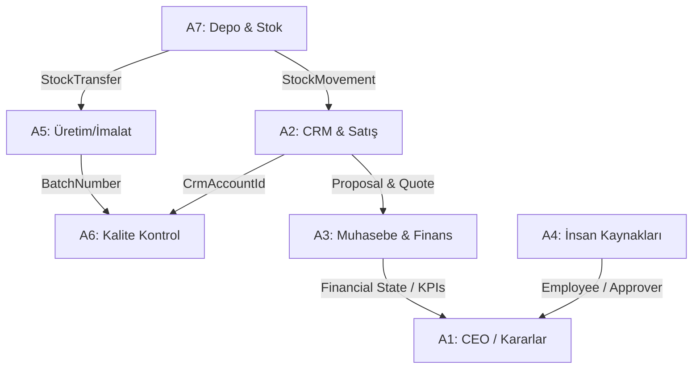

# Bağımlılık Haritası (BAGIMLILIK_HARITASI.md)

Bu döküman, ERP modülleri ve parallel ajanlar (A1-A7) arasındaki ilişkileri, veri akışını ve bağımlılıkları tanımlar. Her ajan, geliştirdiği modülün diğer modüllerle hangi veri noktalarında kesiştiğini buradan takip etmelidir.

---

## 🗺️ 1. Modüller Arası İlişki Diyagramı

---

## 🔗 2. Modüller Arası Entegrasyon Noktaları (Integration Points)

### A6 Kalite Kontrol (QC) ➔ A2 CRM & Satış Bağımlılığı
- **İlişki Tipi:** Foreign Key
- **Detay:** Müşterilerin gönderdiği kalite şikayetleri ve iade talepleri (`QcClaim`), `CrmAccountId` alanı üzerinden doğrudan A2 modülündeki `CrmAccount` tablosuna bağlıdır. 
- **Kısıt:** A6 ajanı şikayet kaydederken ilgili müşterinin A2 CRM veritabanında var olduğunu doğrulamak zorundadır.

### A3 Finans & Muhasebe ➔ A2 CRM & Satış Bağımlılığı
- **İlişki Tipi:** Data Transfer & Event Trigger
- **Detay:** A2 CRM modülünde onaylanan bir teklif (`CrmProposal` - Status: Approved) veya gerçekleştirilen satış işlemi, A3 Finans modülünde otomatik olarak bir Yevmiye Fişi (`FinanceJournalEntry`) ve Cari Hesap borç/alacak hareketi oluşturur.
- **Kısıt:** A3 ajanı, teklif onaylandığında faturayı ve muhasebe fişlerini otomatik oluşturacak entegrasyon servislerini sunmalıdır.

### A7 Lojistik & Sevkiyat ➔ A2 CRM & Satış / A5 Üretim Bağımlılığı
- **İlişki Tipi:** Inventory Control
- **Detay:** A2 Satış modülünde oluşturulan siparişler stoktan düşer (`LogisticsStockMovement` Out). A5 Üretim modülünde tamamlanan üretim emirleri ise stok girişini (`LogisticsStockMovement` In) tetikler.
- **Kısıt:** A7 ajanı, stok hareket metotlarını diğer modüllerin (A2 ve A5) çağırabileceği şekilde servis interface'i (`ILogisticsStockService`) olarak dışarıya açmalıdır.

### A1 CEO Dashboard ➔ Tüm Modüller (KPIs)
- **İlişki Tipi:** Read-Only Analytics Data Aggregation
- **Detay:** A1 CEO ve Yönetici raporlama modülü; A2'den satış hacimlerini, A3'ten kasa/banka nakit akışını, A7'den depo doluluk oranlarını ve A5'ten OTD (On Time Delivery) üretim metriklerini toplayarak tek bir ekranda sunar.

---

## 🛠️ 3. Ajan Çalışma Sıralaması (Sequential Dependency Order)

Bağımlılıklar göz önüne alındığında, kod tabanının kilitlenmemesi için ajanların şu sıralamayı gözetmesi önerilir:
1. **Önce A2 (CRM):** Temel müşteri (`CrmAccount`) verisi oluşmadan QC, Muhasebe veya Lojistik çalıştırılamaz.
2. **Sonra A3 & A7 (Finance & Logistics):** Stok kartları ve cari hesap bakiyeleri bu adımda kurulur.
3. **Sonra A4 & A6 (HR & QC):** Personel kartları ve kalite standartları bu adımda eklenir.
4. **En son A1 (CEO):** Tüm veri kaynakları tamamlandıktan sonra üst raporlama entegre edilir.
