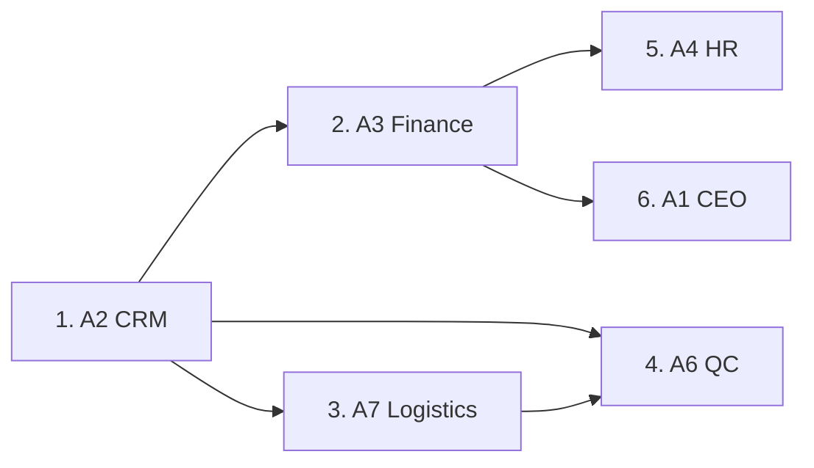

# Veritabanı Migration Planı (VERITABANI_MIGRATION_PLANI.md)

Bu döküman, ERP geçiş sürecinde paralel çalışan ajanların veritabanı tablolarını hangi sırayla oluşturması gerektiğini ve migration çakışmalarını önlemek için izlenecek yolu tanımlar.

---

## 🚦 1. Migration Çalışma Sıralaması (Sequence)

Veritabanı ilişkileri ve foreign key bağlantıları nedeniyle ajanlar migration dosyalarını şu sırayla eklemelidir:



### Detaylı Sıralama Tablosu:

| Aşama | Sorumlu Rol | Eklenecek Tablolar | Bağımlı Olduğu Modül / Tablo |
|:---:|---|---|---|
| **1** | **A2 (Sales/CRM)** | `CrmAccounts`, `CrmContacts`, `CrmOpportunities`, `CrmProposals`, `CrmProposalItems` | Yok (Temel Modül) |
| **2** | **A3 (Finance)** | `FinanceAccountPlans`, `FinanceJournalEntries`, `FinanceJournalEntryLines` | `CrmAccounts` (Cari muhasebe entegrasyonu için) |
| **3** | **A7 (Logistics)** | `LogisticsWarehouses`, `LogisticsStockMovements`, `LogisticsStockTransfers`, `LogisticsStockTransferLines` | `CrmAccounts` (Stok hareketlerindeki sevk carileri için) |
| **4** | **A6 (QC - Kalite)** | `QcStandards`, `QcTestResults`, `QcClaims` | `CrmAccounts` (Şikayetçi müşteri için) & `LogisticsStockMovements` |
| **5** | **A4 (HR - İK)** | `HrEmployees`, `HrLeaveTypes`, `HrLeaves` | `FinanceAccountPlans` (Personel cari maaş hesapları için) |
| **6** | **A1 (CEO)** | `DecisionLogs` | Tüm Tablolar (KPI Raporlama verileri için) |

---

## 🛠️ 2. Ajanlar İçin Migration Çakışmasını (Conflict) Önleme Protokolü

Aynı anda birden fazla ajan veritabanı şeması eklediğinde, EF Core migration snapshot dosyasında (`AppDbContextModelSnapshot.cs`) çakışma yaşanacaktır. Bunu önlemek için şu adımlar izlenmelidir:

1. **Önce Güncel Kodu Çekin:** Kendi migration dosyanızı oluşturmadan önce mutlaka `git pull emaredestek gece-otonom` çalıştırın.
2. **Kendi Migration'ınızı Ekleyin:**
   ```bash
   dotnet ef migrations add Add<ModuleName>Entities --project ../EmareTicket.Persistence --startup-project .
   ```
3. **Snapshot Dosyasını Kontrol Edin:** Git diff kontrolü yaparak `AppDbContextModelSnapshot.cs` dosyasına sadece kendi eklediğiniz tabloların işlendiğinden emin olun.
4. **Veritabanını Güncelleyin:** `dotnet ef database update` komutunu yerel ortamınızda çalıştırın.
5. **Commit Edin:** Migration dosyalarınızı ve snapshot dosyanızı kendi modül commit'inizle kaydedin.
