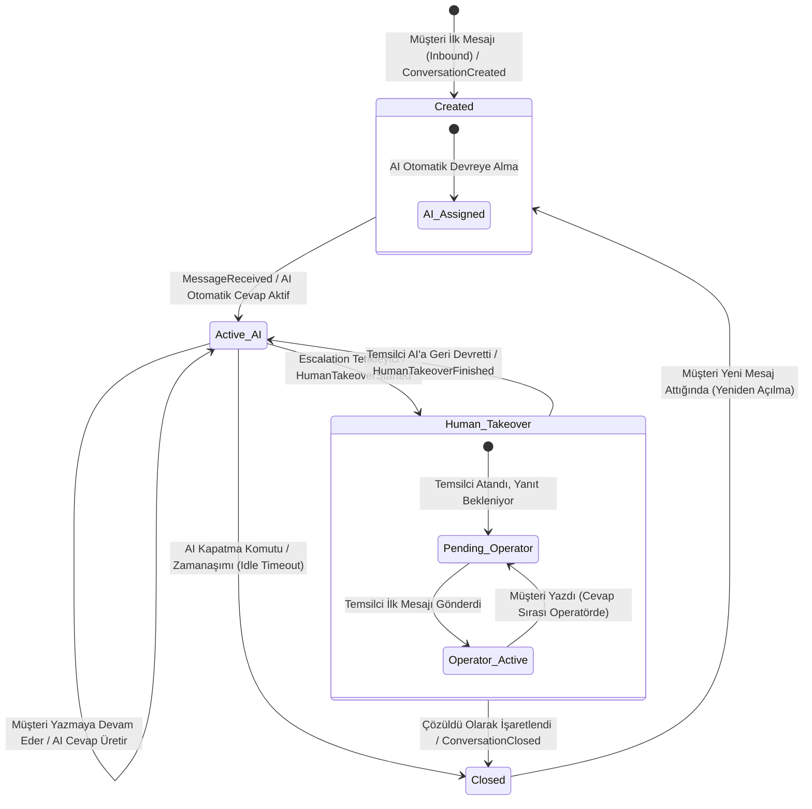

# 🔄 Conversation Lifecycle

**Title:** Conversation Lifecycle  
**Version:** 1.0.0  
**Status:** Approved / Freeze  
**Owner:** Architecture Board  
**Last Updated:** 2026-07-10  
**Dependencies:** DOMAIN_MODEL.md, Conversation_Event_Contract.md  

---

Bu doküman, Omnichannel Messaging Core (OMC) kapsamında bir konuşmanın (Conversation) durum geçişlerini, bu geçişleri tetikleyen olayları (triggers) ve sistem davranışlarını tanımlar.

## Yaşam Döngüsü Durum Diyagramı

---

## Durum ve Geçiş Tanımları

### 1. Created (Oluşturuldu)
* **Açıklama:** Konuşma oturumunun ilk başladığı andır.
* **Giriş Koşulu:** Müşterinin kanalların birinden ilk mesajı göndermesi ve aktif açık bir konuşmanın bulunmaması.
* **Sistem Aksiyonu:** `ConversationCreated` event'i yayınlanır. Cari eşleştirmesi yapılır, `ConversationChannel` kaydı açılır.

### 2. Active_AI (AI Asistan Devrede)
* **Açıklama:** Yapay zeka asistanı müşterinin mesajlarını doğrudan yanıtlar veya temsilciye taslak öneriler sunar.
* **Giriş Koşulu:** Konuşmanın oluşturulması veya insan temsilcinin görüşmeyi AI'a geri devretmesi (`HumanTakeoverFinished`).
* **Sistem Aksiyonu:** Gelen her mesaj için `AIResponseGenerated` tetiklenir ve kanal üzerinden otomatik gönderilir.

### 3. Human_Takeover (İnsan Operatör Devraldı)
* **Açıklama:** AI asistanının otomatik yanıtları durdurulur; konuşma bir insan temsilcinin ekranına düşer.
* **Giriş Koşulu:**
  * Müşterinin açıkça "temsilciye bağlanmak istiyorum" demesi (Intent Detection).
  * AI modelinin güven skorunun (Confidence Score) belirlenen eşiğin altına düşmesi.
  * Temsilcinin panelden konuşmayı manuel "Üzerime Al" butonuyla üstlenmesi.
* **Sistem Aksiyonu:** `HumanTakeoverStarted` event'i yayınlanır. AI auto-reply pasif konuma geçer.

### 4. Closed (Kapatıldı)
* **Açıklama:** Görüşme tamamlanmış ve arşivlenmiştir.
* **Giriş Koşulu:**
  * Temsilcinin konuşmayı "Çözüldü" olarak işaretlemesi.
  * Belirlenen pasiflik süresinin (Örn: 20 dakika boyunca karşılıklı yazışma olmaması) aşılmasıyla otomatik zamanaşımı.
* **Sistem Aksiyonu:** `ConversationClosed` event'i tetiklenir. CRM modülünde konuşma özetlenerek timeline'a işlenir. Müşteriye memnuniyet anketi (CSAT) gönderilebilir.
