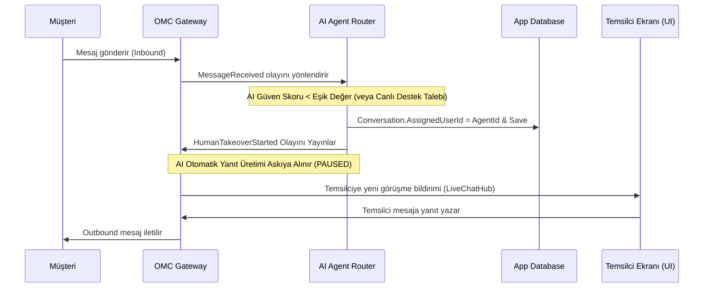

# 🤝 Human Handoff Contract

**Title:** Human Handoff Contract  
**Version:** 1.0.0  
**Status:** Approved / Freeze  
**Owner:** Architecture Board  
**Last Updated:** 2026-07-10  
**Dependencies:** Conversation_Lifecycle.md, Conversation_Event_Contract.md  

---

Bu sözleşme, Omnichannel Messaging Core (OMC) üzerinde çalışan yapay zeka asistanları ile insan operatörler (temsilciler) arasındaki geçişlerin (Human Handoff / Escalation) nasıl yürütüleceğini, durum yönetimini ve denetim (audit) kurallarını tanımlar.

## Handoff Mekanizması ve Akış Yönetimi



---

## Detaylı Protokol Kuralları

### 1. Handoff Tetikleyici Olaylar ve Koşullar
Aşağıdaki durumlarda konuşma otomatik veya manuel olarak insana aktarılır:
* **Müşteri Talebi:** Müşterinin "temsilci", "müşteri hizmetleri", "insan", "bağlan" gibi ifadeler içeren mesajlar atması (Intent detection).
* **Güven Derecesi Hatası:** AI modelinin gelen soruya vereceği cevabın doğruluk güven derecesinin (confidence score) belirlenen kritik sınırın (Örn: %70) altında kalması.
* **Sentiment Analizi:** Müşterinin aşırı sinirli veya şikayetçi bir dille yazması (Negative sentiment threshold).
* **Manuel Müdahale:** Süpervizörün veya aktif izleme yapan bir temsilcinin panelden "Görüşmeyi Üzerime Al" butonuna basması.

### 2. AI Otomatik Yanıtlarının Durdurulması (AI Pausing)
* `HumanTakeoverStarted` olayı yayınlandığı anda, `Conversation` tablosundaki `AssignedUserId` alanı temsilcinin `UserId` değeri ile güncellenir.
* AI mesaj yönlendirme motoru (`AiAgentRouter`), gelen her `MessageReceived` olayında önce veri tabanındaki konuşma durumunu sorgular.
* Eğer konuşmaya atanmış bir insan temsilci (`AssignedUserId != null`) varsa, AI asistanı **kesinlikle sessiz kalır (Mute Mode)** ve otomatik yanıt üretmez.

### 3. AI Asistanının Geri Dönüşü (AI Resuming)
Temsilci müşteriyle işini bitirdiğinde AI asistanını iki şekilde tekrar devreye alabilir:
* **Manuel Geri Devretme:** Temsilci sohbet panelindeki "AI Asistanına Devret" butonuna basar. Bu işlem `ReleaseConversationCommand` tetikler, `AssignedUserId` boşaltılır ve `HumanTakeoverFinished` olayı yayınlanır. AI tekrar otomatik yanıtlara başlar.
* **Sohbeti Çözümleme:** Temsilci sohbeti "Çözüldü" (Resolved/Closed) olarak kapattığında, bir sonraki oturum başladığında AI asistanı varsayılan olarak yeniden otomatik devrededir.

---

## Denetim Günlüğü (Handoff Audit Log)

Handoff geçişlerinin performansı ve şeffaflığı için tüm aksiyonlar `ConversationAuditLog` tablosunda kalıcı olarak saklanır. 

### Denetim Şeması
```csharp
public class ConversationAuditLog : BaseEntity, ITenantEntity
{
    public Guid Id { get; set; }
    public Guid? TenantId { get; set; }
    public Guid ConversationId { get; set; }
    public string Action { get; set; } = string.Empty; // Claim | Release | AI_Pause | AI_Resume | Close
    public Guid? TriggeredByUserId { get; set; }        // Eylemi yapan temsilci kimliği (AI ise null)
    public string Reason { get; set; } = string.Empty; // "Low confidence score" | "Manual claim"
    public DateTime OccurredAt { get; set; }
    public string? MetadataJson { get; set; }          // Ayrıntılı tetikleyici metrikleri (Sentiment, Intent vb.)
}
```
Denetim kayıtları temizlenemez ve değiştirilemez (`Immutable`).
