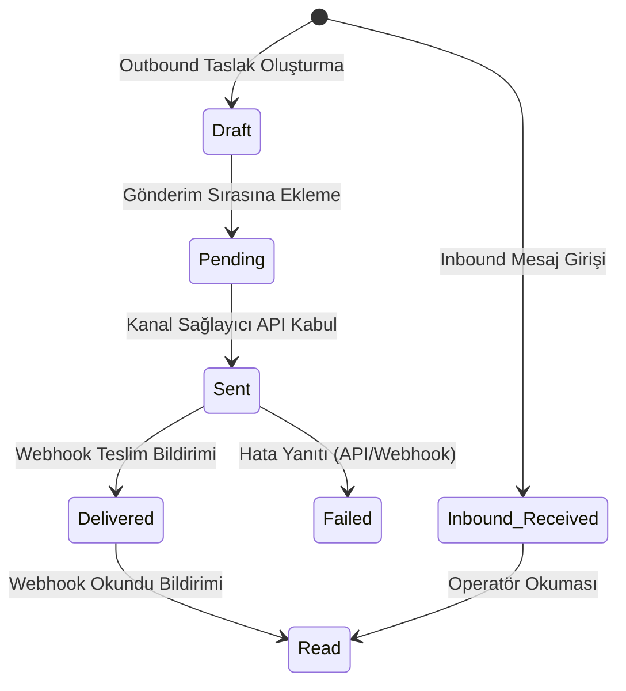

# ✉️ Message Identity Standard

**Title:** Message Identity Standard  
**Version:** 1.0.0  
**Status:** Approved / Freeze  
**Owner:** Architecture Board  
**Last Updated:** 2026-07-10  
**Dependencies:** DOMAIN_MODEL.md  

---

Bu doküman, Omnichannel Messaging Core (OMC) kapsamında üretilen her mesajın kimliklendirilmesi, taşınması ve durum takibine ait veri şemalarını ve değişmezlik (immutability) kurallarını belirler.

## Mesaj Veri Şeması ve Minimum Alanlar

Sistemdeki her mesaj (`ConversationMessage` nesnesi) veri tabanında ve servisler arasında en az aşağıdaki alanları taşımak zorundadır:

| Alan Adı | Veri Tipi | Sorumluluk / Açıklama | Değişmezlik (Immutable) |
|---|---|---|---|
| **InternalMessageId** | `Guid` | Emare BOS içinde oluşturulan birincil anahtar (Primary Key). | **Evet** |
| **ExternalMessageId** | `string` | Kanal sağlayıcısından (Meta, WhatsApp Cloud API vb.) dönen mesaj kimliği (wamid, mid vb.). | **Evet** (Gönderim sonrası) |
| **ConversationId** | `Guid` | Mesajın ait olduğu konuşma oturumunun kimliği (Foreign Key). | **Evet** |
| **TenantId** | `Guid` | Kiracı organizasyon kimliği. Tenant sızıntısını önlemek için kritik. | **Evet** |
| **Channel** | `OmniChannelType` | Mesajın alındığı/gönderildiği kanal tipi (WhatsApp, Messenger vb.). | **Evet** |
| **Direction** | `MessageDirection` | Mesaj yönü (Inbound = 1, Outbound = 2). | **Evet** |
| **MessageType** | `OmniMessageType` | Mesajın tipi (Text, Image, Video, Audio, Document, Interactive). | **Evet** |
| **Content** | `string?` | Mesaj metin içeriği. | **Hayır** (Edited durumunda değişebilir) |
| **CorrelationId** | `Guid` | İstek yaşam döngüsü boyunca izlenebilirlik sağlayan takip kimliği. | **Evet** |
| **TraceId** | `string?` | HTTP / Webhook istek zinciri (Distributed Tracing) takip kimliği. | **Evet** |
| **CreatedAt** | `DateTime` | Mesajın sisteme giriş zamanı (UTC). | **Evet** |
| **ReadAt** | `DateTime?` | Mesajın okunduğu zaman (UTC). Inbound ise operatör okuma zamanı; Outbound ise müşteri okuma zamanı. | **Hayır** (Sonradan güncellenir) |
| **Status** | `MessageStatus` | Mesaj durumu (Pending, Sent, Delivered, Read, Failed, Deleted, Draft). | **Hayır** (Webhook bildirimleriyle güncellenir) |
| **RetryCount** | `int` | Mesaj gönderiminde kaç kez hata alınıp tekrar denendiği bilgisi. | **Hayır** |
| **Version** | `int` | Concurrency kontrolü ve event versiyonlama için sayaç (Varsayılan: 1). | **Hayır** (Düzenlemelerde artar) |
| **SentByUserId** | `Guid?` | Mesajı gönderen kullanıcı (İnsan operatör veya AI Agent ID). | **Evet** |

---

## Değişmezlik (Immutability) Kuralları

1. **Mesaj Gövdesi Değişmezliği (İstisna Hariç):**
   * Bir mesaj veri tabanına yazıldıktan sonra, `Content` alanı müşteri veya operatör mesajı düzenlemediği sürece (`MessageEdited` tetiklenmediği sürece) kesinlikle değiştirilemez.
   * Düzenlenen mesajlarda eski içerik silinmez; audit/güvenlik amacıyla `ConversationMessageHistory` veya `AuditLog` içerisine yedeklenir.

2. **Kanal ve Yön Sabitliği:**
   * Bir mesajın `Channel`, `Direction`, `TenantId` ve `ConversationId` alanları oluşturulma anında kilitlenir. Bir mesaj sonradan başka bir konuşmaya kaydırılamaz veya kanalı değiştirilemez.

3. **External ID Eşleşmesi:**
   * Dışarı gönderilen (outbound) mesajlarda, mesaj kuyruktayken `ExternalMessageId` geçici bir taslak ID (`draft-guid`) taşır. Kanal sağlayıcı API'si mesajı kabul edip gerçek ID döndüğünde bu alan **bir kereye mahsus** güncellenir ve ardından kilitlenir.

---

## Mesaj Durum Yaşam Döngüsü (MessageStatus)

Mesajlar gönderim ve alım akışlarında aşağıdaki durumları takip eder:

