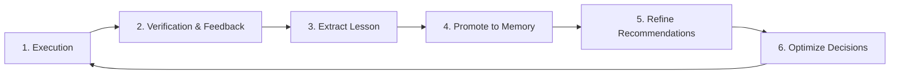

# 🎓 Platform Learning Engine Specification

**Title:** Platform Learning Engine Specification  
**Task Code:** TASK_CT_008  
**Status:** Approved for Implementation  
**Owner:** Principal Platform Architect  
**Last Updated:** 2026-07-11  

---

## 1. Closed-Loop Learning Platform

The **Platform Learning Engine (PLE)** closes the cognitive loop of the Emare Operating System (EOS). By continuously analyzing execution outcomes and human override events, it trains decision templates and aligns AI prompts.

---

## 2. Recommendation Training & Feedback Rules

The PLE uses decision feedback loops:
- When a decision (e.g. `DEPLOY`) is overridden by a human operator (e.g. forced to `ROLLBACK`), the PLE reduces the confidence index of that specific decision rule.
- Repeated overrides prompt a suggestion to modify the policy logic, keeping AI behaviors aligned with human oversight.
