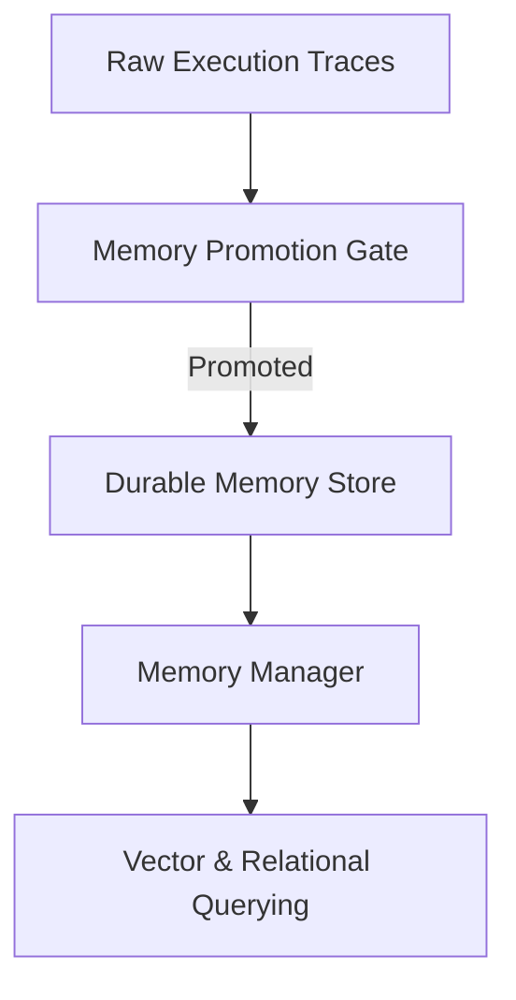

# 🧠 Platform Memory Engine Specification (PMLE)

**Title:** Platform Memory Engine Specification  
**Task Code:** TASK_CT_008  
**Status:** Approved for Implementation  
**Owner:** Principal Platform Architect  
**Last Updated:** 2026-07-11  

---

## 1. Overview & Architectural Goals

The **Platform Memory Engine (PME)** is the cognitive persistence layer of the Emare Operating System (EOS) Control Tower. Its objective is to capture, structure, version, and promote operational telemetry and cognitive execution logs into high-value **durable memory**.

Decoupling raw execution logs from refined learning memory prevents data bloat. PME implements the `Trace -> Promotion Gate -> Durable Memory -> Retrieval` pattern.



---

## 2. Typed Memory Schema Mappings

PME categorizes platform state into 6 typed memory records:

1. **Execution Memory**: Workflow execution traces, step Durations, retry budgets, rollback metrics.
2. **Decision Memory**: Governed operational decisions, evidence blocks, confidence thresholds, operator override events.
3. **Product Memory**: Product DNA configuration metadata, architecture revisions, releases history.
4. **Knowledge Memory**: ADR registries, platform constitution, code style guides.
5. **Learning Memory**: Refined lessons learned, recurring failure patterns, optimization recommendations.
6. **AI Memory**: Agent confidence metrics, operator corrective prompts, tool utilization reliability indices.

---

## 3. Memory Manager Interface (`IMemoryManager`)

```csharp
namespace EmareTicket.Application.Abstractions.Elyaf;

using System;
using System.Collections.Generic;
using System.Threading;
using System.Threading.Tasks;
using EmareTicket.Contracts.Elyaf;

public interface IMemoryManager
{
    Task<string> StoreMemoryAsync(PlatformMemoryEntryDto entry, CancellationToken ct = default);
    Task<PlatformMemoryEntryDto> RetrieveMemoryAsync(string memoryId, CancellationToken ct = default);
    Task<bool> PromoteMemoryAsync(string traceId, CancellationToken ct = default);
    Task<List<PlatformMemoryEntryDto>> SearchMemoryAsync(string query, string type = null, CancellationToken ct = default);
    Task<bool> ReplayMemoryAsync(string memoryId, CancellationToken ct = default);
}
```
