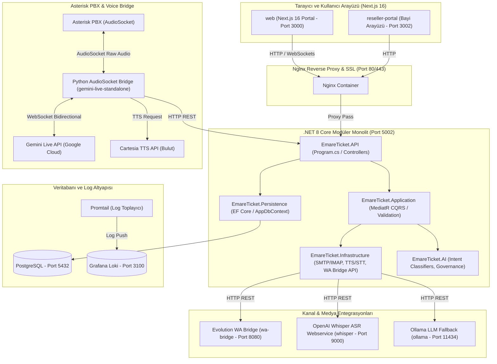

# Emare Ai Dashboard — Sistem Topolojisi ve Özellik Fihristi

Bu belge, **Emare Ai Dashboard** platformunun yazılımsal altyapısını, veri modellerini, kanal entegrasyonlarını, yapay zeka aksiyon motorunu ve tüm kod tabanındaki özellikleri detaylandıran kapsamlı bir fihrist ve topoloji kılavuzudur.

---

## 🗺️ 1. Mimari ve Ağ Topolojisi (Mermaid)

Platform; **.NET 8 modüler monolit**, **Next.js 16 (Turbopack)** frontend ve bağımsız **Asterisk Santral + Python AudioSocket Ses Köprüsü** katmanlarından oluşur.

---

## 🗃️ 2. Veri Yapısı ve Entity Kataloğu (48 Tablo/Entity)

Platformun [AppDbContext.cs](file:///Users/emre/Elyafgroup/src/EmareTicket.Persistence/Context/AppDbContext.cs) üzerinde tanımlı 48 adet veritabanı tablosu ve domain katmanındaki [Entities](file:///Users/emre/Elyafgroup/src/EmareTicket.Domain/Entities/) karşılıkları şunlardır:

### 🏢 Firma (Multi-Tenant) ve Genel Sistem Ayarları
1. **[Tenant](file:///Users/emre/Elyafgroup/src/EmareTicket.Domain/Entities/Tenant.cs):** Çoklu kiracı izolasyonunun kök tablosu. Firma adı, alt alan adı (subdomain), lisans durumu, IMAP/SMTP genel ayarları.
2. **[Branch](file:///Users/emre/Elyafgroup/src/EmareTicket.Domain/Entities/MegaPlusEntities.cs#L54):** Firmaya bağlı şubeler ve bayiler. Telefon DID numaraları, çalışma saatleri, özel yönlendirme ses senaryoları.
3. **[TenantApiKey](file:///Users/emre/Elyafgroup/src/EmareTicket.Domain/Entities/TenantApiKey.cs):** Harici servislerin kiracı adına API erişimi için şifrelenmiş API anahtarları.
4. **[SubscriptionPlan](file:///Users/emre/Elyafgroup/src/EmareTicket.Domain/Entities/SubscriptionPlan.cs):** Sistemde tanımlı üyelik planları (Standart, Gold, MegaPlus).
5. **[PlatformFeedback](file:///Users/emre/Elyafgroup/src/EmareTicket.Domain/Entities/PlatformFeedback.cs):** Kullanıcıların sistem hakkındaki geri bildirimleri ve hata raporları.
6. **[OnboardingSessionRecord](file:///Users/emre/Elyafgroup/src/EmareTicket.Domain/Entities/OnboardingSessionRecord.cs):** Yeni firmaların kurulum sihirbazı (onboarding) durumları.
7. **[ProvisioningToken](file:///Users/emre/Elyafgroup/src/EmareTicket.Domain/Entities/ProvisioningToken.cs):** Kurulum esnasında kullanılan tek kullanımlık doğrulama belirteçleri.

### 🔐 Kullanıcı, Rol ve İzin Altyapısı
8. **[User](file:///Users/emre/Elyafgroup/src/EmareTicket.Domain/Entities/User.cs):** Kullanıcı hesapları. E-posta, şifre hash'i (BCrypt), ad/soyad, yetkili ses şifresi (Voice PIN) ve aktiflik durumu.
9. **[Role](file:///Users/emre/Elyafgroup/src/EmareTicket.Domain/Entities/ChatEntities.cs#L182):** Kullanıcı rolleri (SuperAdmin, Admin, Reseller, Manager, User, Coordinator).
10. **[Permission](file:///Users/emre/Elyafgroup/src/EmareTicket.Domain/Entities/ChatEntities.cs#L182):** Sistemdeki aksiyonlar için tanımlı yetkiler (dashboard.view, roles.view, users.manage, etc.).
11. **[UserRole](file:///Users/emre/Elyafgroup/src/EmareTicket.Domain/Entities/ChatEntities.cs#L182):** Kullanıcı ve Rol eşleşmeleri (Çoka Çok ilişki).
12. **[RolePermission](file:///Users/emre/Elyafgroup/src/EmareTicket.Domain/Entities/ChatEntities.cs#L182):** Rollere atanan izin matrisi. Sistem açılırken `RolePermissionCatalog` dosyasından otomatik senkronize edilir.
13. **[RefreshToken](file:///Users/emre/Elyafgroup/src/EmareTicket.Domain/Entities/RefreshToken.cs):** JWT oturumlarının sessizce yenilenmesi için kullanılan yenileme token'ları.

### 👥 CRM & Satış
14. **[Customer](file:///Users/emre/Elyafgroup/src/EmareTicket.Domain/Entities/Customer.cs):** Müşteri / Cari hesaplar. NPS skoru, risk segmenti, finansal sağlık skoru ve adres bilgileri.
15. **[CrmContact](file:///Users/emre/Elyafgroup/src/EmareTicket.Domain/Entities/CustomerRelated.cs):** Müşteri firmalarındaki kontak kişiler. Ad soyad, e-posta, telefon, unvan.
16. **[SalesLead](file:///Users/emre/Elyafgroup/src/EmareTicket.Domain/Entities/SalesEntities.cs#L27):** Satış fırsatları ve potansiyel müşteriler (Lead). Olasılık, tahmini değer, beklenen kapanış tarihi.
17. **[SalesLeadActivity](file:///Users/emre/Elyafgroup/src/EmareTicket.Domain/Entities/SalesEntities.cs#L58):** Satış fırsatına bağlı yapılan aramalar, yazışmalar ve notların geçmişi.
18. **[SalesLeadItem](file:///Users/emre/Elyafgroup/src/EmareTicket.Domain/Entities/SalesEntities.cs#L70):** Satış fırsatına eklenen ürünler, miktarlar ve birim fiyatlar.
19. **[CustomerNote](file:///Users/emre/Elyafgroup/src/EmareTicket.Domain/Entities/CustomerRelated.cs):** Carilere eklenen serbest metin notları.
20. **[CustomerActivity](file:///Users/emre/Elyafgroup/src/EmareTicket.Domain/Entities/CustomerRelated.cs):** Müşteri bazlı genel aktiviteler.
21. **[CustomerFile](file:///Users/emre/Elyafgroup/src/EmareTicket.Domain/Entities/CustomerRelated.cs):** Müşteri dosyaları, sözleşmeler ve evrak ekleri.

### 📄 Teklif, Sipariş ve Finans
22. **[Proposal](file:///Users/emre/Elyafgroup/src/EmareTicket.Domain/Entities/Proposal.cs):** Müşterilere sunulan resmi teklifler. Geçerlilik süresi, indirim oranları, toplam tutarlar.
23. **[ProposalView](file:///Users/emre/Elyafgroup/src/EmareTicket.Domain/Entities/ProposalView.cs):** Teklif bağlantısının (URL) müşteri tarafından ne zaman, hangi IP ve cihazdan kaç kez görüntülendiğinin takibi.
24. **[Product](file:///Users/emre/Elyafgroup/src/EmareTicket.Domain/Entities/ProductAndOrder.cs#L21):** Ürün kartları. Barkod, stok kodu, KDV oranı, fiyatı.
25. **[Order](file:///Users/emre/Elyafgroup/src/EmareTicket.Domain/Entities/ProductAndOrder.cs#L37):** Alınan siparişler. Sevk adresi, ödeme durumu, sipariş aşamaları.
26. **[OrderItem](file:///Users/emre/Elyafgroup/src/EmareTicket.Domain/Entities/ProductAndOrder.cs#L63):** Sipariş satırları. Ürün bilgisi, miktar, satır indirimi.
27. **[Payment](file:///Users/emre/Elyafgroup/src/EmareTicket.Domain/Entities/ProductAndOrder.cs#L81):** Tahsilat ve ödeme kayıtları.
28. **[PaymentPromise](file:///Users/emre/Elyafgroup/src/EmareTicket.Domain/Entities/PaymentPromise.cs):** Sözlü ödeme taahhütleri. Yapay zeka sesli asistan tarafından telefonda otomatik oluşturulup takip edilir.
29. **[FinanceAccountPlan](file:///Users/emre/Elyafgroup/src/EmareTicket.Domain/Entities/MegaPlusEntities.cs):** Cari hesap planları (Borç/Alacak takibi).
30. **[FinanceJournalEntry](file:///Users/emre/Elyafgroup/src/EmareTicket.Domain/Entities/MegaPlusEntities.cs):** Finansal yevmiye fişleri.
31. **[FinanceJournalEntryLine](file:///Users/emre/Elyafgroup/src/EmareTicket.Domain/Entities/MegaPlusEntities.cs):** Yevmiye fiş satırları (Borç-Alacak dengesi).

### 🎫 Destek Talepleri (Service Desk / Help Desk)
32. **[SupportTicket](file:///Users/emre/Elyafgroup/src/EmareTicket.Domain/Entities/SupportTicketEntities.cs#L21):** Destek biletleri (Tickets). Konu, öncelik, durum (Yeni, Açık, Beklemede, Çözüldü), atanan personel.
33. **[SupportTicketActivity](file:///Users/emre/Elyafgroup/src/EmareTicket.Domain/Entities/SupportTicketEntities.cs#L67):** Bilet üzerindeki durum değişiklikleri, atamalar ve dahili açıklamalar.
34. **[TicketMergeHistory](file:///Users/emre/Elyafgroup/src/EmareTicket.Domain/Entities/SupportTicketEntities.cs#L94):** Mükerrer biletlerin birleştirilme geçmişi.
35. **[TicketProcess](file:///Users/emre/Elyafgroup/src/EmareTicket.Domain/Entities/SupportTicketEntities.cs#L107):** Farklı destek departmanları için iş süreçleri (Workflows).
36. **[TicketProcessStage](file:///Users/emre/Elyafgroup/src/EmareTicket.Domain/Entities/SupportTicketEntities.cs#L125):** İş süreçlerine ait aşamalar (örn: Analiz -> Test -> Dağıtım).
37. **[TicketFieldDefinition](file:///Users/emre/Elyafgroup/src/EmareTicket.Domain/Entities/SupportTicketFieldEntities.cs#L5):** Destek taleplerine dinamik olarak eklenen özel alanlar (Örn: Sipariş No, Hata Tipi).
38. **[TicketFieldVisibilityRule](file:///Users/emre/Elyafgroup/src/EmareTicket.Domain/Entities/SupportTicketFieldEntities.cs#L24):** Özel alanların hangi aşamada görüneceğini belirleyen iş kuralları.

### 📞 Çağrı Merkezi ve Santral (Telephony)
39. **[CallLog](file:///Users/emre/Elyafgroup/src/EmareTicket.Domain/Entities/CallCenterEntities.cs#L8):** Tüm aramaların özet kayıtları. Kayıt linki, yönü, yapay zekanın yanıtlayıp yanıtlamadığı, AI çağrı özeti.
40. **[CallDetailRecord](file:///Users/emre/Elyafgroup/src/EmareTicket.Domain/Entities/CallCenterEntities.cs#L92):** Asterisk'ten gelen ham CDR verileri (Ring, Dial, Billsec, vb.).
41. **[CallCampaign](file:///Users/emre/Elyafgroup/src/EmareTicket.Domain/Entities/CallCenterEntities.cs#L162):** Yapay zeka ile otomatik arama kampanyaları.
42. **[CallCampaignContact](file:///Users/emre/Elyafgroup/src/EmareTicket.Domain/Entities/CallCenterEntities.cs#L231):** Kampanya kapsamında aranacak numaraların listesi ve arama sonuçları.
43. **[SipTrunk](file:///Users/emre/Elyafgroup/src/EmareTicket.Domain/Entities/CallCenterEntities.cs#L268):** Santralin dış dünyaya bağlandığı VoIP hatları (SIP Trunk).
44. **[SipExtension](file:///Users/emre/Elyafgroup/src/EmareTicket.Domain/Entities/CallCenterEntities.cs#L327):** WebRTC veya IP telefonlar için tanımlı dahili numaralar (Extensions).
45. **[VoiceScenario](file:///Users/emre/Elyafgroup/src/EmareTicket.Domain/Entities/VoiceScenario.cs):** Sesli asistanın IVR / Akış şeması.
46. **[VoiceScenarioVersion](file:///Users/emre/Elyafgroup/src/EmareTicket.Domain/Entities/VoiceScenarioVersion.cs):** Akış şemalarının versiyon geçmişi.
47. **[StaffCallbackRequest](file:///Users/emre/Elyafgroup/src/EmareTicket.Domain/Entities/StaffCallbackRequest.cs):** Müşterilerin sesli asistan üzerinden talep ettiği "beni arayın" bildirimleri.

### 💬 WhatsApp, Telegram ve E-posta Entegrasyonları
48. **[WhatsAppAccount](file:///Users/emre/Elyafgroup/src/EmareTicket.Domain/Entities/WhatsApp.cs#L14):** WhatsApp QR oturumları ve bağlantı durumları.
49. **[WhatsAppConversation](file:///Users/emre/Elyafgroup/src/EmareTicket.Domain/Entities/WhatsApp.cs#L45):** WhatsApp üzerindeki bireysel sohbet odaları.
50. **[WhatsAppMessage](file:///Users/emre/Elyafgroup/src/EmareTicket.Domain/Entities/WhatsApp.cs#L75):** WhatsApp mesaj geçmişi (Text, Media, Button mesajları).
51. **[WhatsAppMenu](file:///Users/emre/Elyafgroup/src/EmareTicket.Domain/Entities/WhatsApp.cs#L125):** WhatsApp asistanı için otomatik IVR menüleri.
52. **[WhatsAppMenuOption](file:///Users/emre/Elyafgroup/src/EmareTicket.Domain/Entities/WhatsApp.cs#L147):** WhatsApp menü seçenekleri (1'e basınca bilet aç, 2'ye basınca randevu ver).
53. **[WhatsAppScheduledMessage](file:///Users/emre/Elyafgroup/src/EmareTicket.Domain/Entities/WhatsAppScheduledMessage.cs):** İleri tarihli toplu veya bireysel WhatsApp gönderim emirleri.
54. **[TelegramAccount](file:///Users/emre/Elyafgroup/src/EmareTicket.Domain/Entities/Telegram.cs#L5):** Telegram Bot API token'ları ve kiracı eşleşmeleri.
55. **[MailAccount](file:///Users/emre/Elyafgroup/src/EmareTicket.Domain/Entities/MailEntities.cs#L18):** SMTP / IMAP e-posta hesapları. Şifreli şifre saklama (AES-256) ve otomatik senkronizasyon zamanları.
56. **[OutboundEmail](file:///Users/emre/Elyafgroup/src/EmareTicket.Domain/Entities/MailEntities.cs#L107):** Sistemden giden e-postaların arşivi.
57. **[InboundEmail](file:///Users/emre/Elyafgroup/src/EmareTicket.Domain/Entities/MailEntities.cs#L225):** Gelen kutusundan (IMAP Poller) çekilen e-postalar.

---

## 🛠️ 3. Modüller ve Yazılım Özellik Kataloğu

### 🧠 A. Yapay Zeka Aksiyon Motoru (AI Action Engine)
* **Konum:** [AiActionService.cs](file:///Users/emre/Elyafgroup/src/EmareTicket.Infrastructure/Services/Ai/AiActionService.cs)
* **Özellikler:**
  - **Niyet Sınıflandırma (Intent Classification):** Chat veya telefon kanalından gelen girdileri yapay zeka ile analiz ederek ilgili API aksiyonlarına eşler.
  - **Çakışma Kontrolü (Appointment Conflict Check):** Randevu oluşturulurken mevcut randevularla çakışma durumunda otomatik algılama ve sesli/yazılı olarak alternatif boş saatler önerme ([AiActionServiceTests.cs](file:///Users/emre/Elyafgroup/tests/EmareTicket.Tests/AI/AiActionServiceTests.cs#L94)).
  - **Mükerrer İstek Engelleme (Idempotency / Dedup):** Kısa süre içinde gelen aynı isteklerin (örn: arka arkaya "randevu al" denmesi) veritabanında mükerrer kayıt oluşturmasını engeller.
  - **Hata Yakalama ve Retry (Dead-Letter Queue):** Entegrasyon hataları nedeniyle yarım kalan sistem komutlarını `DeadLetter` durumuna alır, loglar ve otomatik kurtarma mekanizmasını tetikler ([AiActionServiceTests.cs](file:///Users/emre/Elyafgroup/tests/EmareTicket.Tests/AI/AiActionServiceTests.cs#L212)).
  - **Çift Aşamalı Teklif Onayı (Proposal Confirmation):** Kritik finansal işlemler (teklif gönderme, kampanya başlatma) öncesi kullanıcıdan onay istenir ([AiActionServiceTests.cs](file:///Users/emre/Elyafgroup/tests/EmareTicket.Tests/AI/AiActionServiceTests.cs#L244)).

### 📞 B. Telefon Altyapısı (Asterisk + Whisper + Gemini Live)
* **Konum:** [standalone_bridge.py](file:///Users/emre/Elyafgroup/gemini-live-standalone/standalone_bridge.py)
* **Özellikler:**
  - **Gerçek Zamanlı AudioSocket Köprüsü:** Asterisk ile Gemini Live API arasında 8kHz/16-bit PCM ses akışını çift yönlü yönetir.
  - **Dolgu Anonsları (Wait/Filler Audio):** Arka planda tool çağrısı (müşteri sorgusu, bilet açma vb.) 2.5 saniyeden uzun sürerse "Bir saniye lütfen, işleminizi gerçekleştiriyorum" şeklinde dolgu sesleri basarak hattın sessiz kalmasını ve kullanıcının kapatmasını engeller ([standalone_bridge.py](file:///Users/emre/Elyafgroup/gemini-live-standalone/standalone_bridge.py#L3637)).
  - **Yönetici Ses Şifresi (Voice PIN):** Yetkili kullanıcılar aradığında 4 haneli PIN şifresini sesle veya tuşla (DTMF) doğrulamadan kritik işlemlere izin vermez ([standalone_bridge.py](file:///Users/emre/Elyafgroup/gemini-live-standalone/standalone_bridge.py#L3091)).
  - **Akıllı Ses Kesme (Barge-in / VAD):** Konuşma algılandığında asistanın konuşmasını kesip dinlemeye geçmesini sağlayan gürültü geçidi filtresi ve RMS hesaplaması.
  - **Ses Telaffuz İyileştirmeleri:** Canlı demolar için "CRM" ve "ERP" kelimelerini `"Cereem"` ve `"Erepe"` şeklinde prompt yönlendirmesiyle doğru telaffuz ettirir.

### ✉️ C. Çok Kanallı İletişim (Omnichannel)
* **WhatsApp QR Eşleşme:** Evolution API entegrasyonu ile panel üzerinden WhatsApp Business dışı şahsi hatları QR kod ile sisteme bağlar ([WhatsAppQrBridgeService.cs](file:///Users/emre/Elyafgroup/src/EmareTicket.Infrastructure/Services/WhatsApp/WhatsAppQrBridgeService.cs)).
* **Otomatik IMAP E-posta Poller:** Tanımlı tarih aralıklarına göre gelen mailleri otomatik olarak tarayıp AI analizi ile otomatik olarak destek taleplerine dönüştürür.
* **Canlı Sohbet (Live Chat Widget):** Çalışma saatleri kuralları, otomatik hazır yanıtlar (canned replies) ve Next.js tabanlı operatör arayüzü.

### 🏢 D. Kontrol Kulesi (Control Tower)
* **Konum:** [web/src/app/(dashboard)/layout.tsx](file:///Users/emre/Elyafgroup/web/src/app/(dashboard)/layout.tsx)
* **Özellikler:**
  - **CEO Kulesi (Decisions Log):** Stratejik kararların takibi ve durum onay akışları.
  - **Kalite Kontrol Kulesi (Quality Control):** Tolerans limitleri aşan test sonuçlarının ve müşteri şikayetlerinin (claims) görselleştirilmesi.
  - **Lojistik Kulesi (Logistics):** Depolar arası stok transferi onay akışı (çift yetkili onay mekanizması).

---

## 📈 4. Canlı Sistem Servisleri ve Port Eşleşmeleri

Sunucu üzerinde ayağa kalkan Docker container'ları ve ağ topolojisi şu şekilde yapılandırılmıştır:

| Servis Adı | Container Adı | Port (Internal) | Port (External) | Görevi |
|------------|---------------|-----------------|-----------------|--------|
| **nginx** | `emareticket-nginx-prod` | 80 / 443 | 80 / 443 | SSL Sonlandırma & Reverse Proxy |
| **api** | `emareticket-api-prod` | 8080 | 5002 | .NET 8 Backend API |
| **web** | `emareticket-web-prod` | 3000 | 3000 | Next.js Ana Dashboard |
| **reseller-portal** | `emareticket-reseller-portal-prod` | 3002 | 3002 | Next.js Bayi Portalı |
| **wa-bridge** | `emareticket-wa-bridge` | 8080 | - | Evolution WhatsApp API |
| **whisper** | `emareticket-whisper-prod` | 9000 | - | Ses Dosyaları STT Çözümleyici |
| **ollama** | `emareticket-ollama` | 11434 | 11434 | Yerel Llama-3 Fallback Servisi |
| **postgres** | `emareticket-postgres-prod` | 5432 | 5432 | PostgreSQL Ana Veritabanı |
| **loki** | `emareticket-loki` | 3100 | - | Grafana Loki Log Sunucusu |
