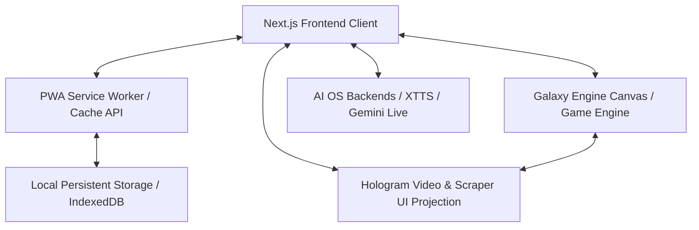

# Elyafgroup Web Portali ve Kainat Paneli Mimari Tasarım Dokümanı

Bu doküman, **Elyafgroup Web Portali**, **Galaxy Engine (Kainat Tasarım Motoru)** ve **Lead Çok Katmanlı Tarayıcı (Chrome Extension Scraper)** arasındaki veri/görsel entegrasyonunu, offline-first yerel önbellekleme (PWA Service Worker) altyapısını ve hologram tabanlı 360 derece uzamsal görüntüleme sistemini tanımlar.

---

## 1. Genel Mimari Görünüm

Sistem, soyut yazılım operasyonlarını, veri tabanlarını ve ajansal görevleri (Missions & Tasks) görsel olarak yaşayan bir gökada (Universe) olarak tasvir ederken; bu gökadayı kullanan kullanıcıya sıfır gecikmeli (0ms), çevrimdışı çalışabilen ve tarayıcı entegrasyonuyla otomatize edilmiş bir portal sunar.

---

## 2. Sıfır Gecikmeli Offline-First Mimari (PWA & Service Worker)

Büyük boyutlu video stream'leri (gezegen yüzey kaplamaları, arka plan nebula döngüleri, hologram dosyaları) ve 3D assetlerin internete bağlı olmaksızın anında yüklenebilmesi için tarayıcı üzerinde gelişmiş bir **Service Worker** katmanı konumlandırılmıştır.

### 2.1 Kalıcı Depolama (Persistent Storage)
Kullanıcı web portalına ilk girdiğinde tarayıcıdan **Kalıcı Depolama İzni** (`navigator.storage.persist()`) talep edilir. İzin onaylandığında:
* Tarayıcının geçici önbellek temizleme algoritmaları devre dışı bırakılır.
* Önbelleğe alınan MP4 videoları ve 3D texture dosyaları bilgisayarda kalıcı olarak tutulur.
* İnternet bağlantısı koptuğunda portal tamamen lokalden çalışır.

### 2.2 Akışkan Medya Önbellekleme (Media Range Requests Caching)
Büyük video dosyaları doğrudan önbellekten çekilirken tarayıcının `Range` (kısmi içerik) isteklerine yanıt verebilmesi için Service Worker, video isteklerini yakalayarak byte-range buffer'lar üzerinden sanal stream oluşturur:
* Video istekleri algılandığında önbellekte parça parça (`206 Partial Content`) şeklinde arabelleğe alınır.
* Değişen dosyalar, internete bağlı olunduğunda sunucudaki ETag/Last-Modified başlıkları kontrol edilerek sadece farklar (delta updates) halinde indirilir.

---

## 3. Kainat Paneli & Galaxy Engine Entegrasyonu

Görsel motorumuz (`scripts/galaxy-engine-v2.js` / Canvas 2D & Three.js `0.152.x`), disk üzerindeki otonom ajan state dosyalarını (`MISSION_BOARD.md`, `TASK_QUEUE.md`, `events.jsonl`) okuyarak gezegen formatında bir kainat paneli oluşturur.

### 3.1 Gezegen Veri ve Durum Eşlemesi
* **Gezegenler (Missions)**: Projedeki ana geliştirme/iş hedeflerini temsil eder. Boyutları barındırdıkları aktif task sayısına, renkleri ise tamamlanma oranına (`ACTIVE`: Mavi, `CLOSED`: Mor/Yeşil) göre dinamik belirlenir.
* **Uydular (Tasks)**: Gezegen etrafındaki dairesel yörüngelerde dönen uydular. Renkleri iş akışı aşamalarını (Örn: `DONE`: Yeşil, `NEEDS_FIX`: Kırmızı) gösterir.
* **Kuyruklu Yıldızlar (Events)**: Sunucudaki canlı `events.jsonl` log akışından tetiklenen, merkez güneşten (Emare AI) ilgili gezegene akan parlak veri comets.

---

## 4. Çok Katmanlı Tarayıcı (Lead Chrome Extension) Köprüsü

Geliştirdiğimiz çok katmanlı **Lead Tarayıcı** (Chrome Extension Scraper / Crawler), web portalı ile entegre çalışır.

### 4.1 Gezegen Tıklaması ve Tarayıcı Aktivasyonu
Gezegenlere tıklandığında veya kokpit moduna geçildiğinde web uygulaması ile uzantı arasında güvenli Message Passing hattı kurulur:
1. **Tetikleme**: Kullanıcı gökadadaki bir gezegene tıkladığında Next.js portali `window.postMessage` veya `chrome.runtime.sendMessage` ile hedef gezegene atanmış Lead tarama görevini tetikler.
2. **Crawler Çalışması**: Lead tarayıcının arka plan scripti, ilgili web sayfasında otonom veri toplama (telefon, adres, harita verisi) işlemini başlatır.
3. **Senkronizasyon**: Elde edilen lead verileri `apiUrl` üzerinden Next.js portalına geri beslenir ve ilgili gezegene ait uydularda (`Tasks`) yeşil "DONE" statüsü olarak güncellenir.

### 4.2 Yıldızlar ve 360 Derece Hologram Görüntüleyici
Gezegenlerin ve yıldızların etrafında, 360 derece uzamsal bir hologram katmanı bulunur:
* **Hologram Yansıtma**: Lead tarayıcının o anki canlı tarama ekran görüntüsü (örneğin `scratch_inspect.png` veya `maps_consent.png`), gezegen etrafındaki uzamsal bir yansıtıcı yüzey (Canvas clipping mask veya Three.js sphere wrapper) üzerine hologram efektli ve yarı saydam (`opacity: 0.65`) olarak giydirilir.
* **Video Devamlılığı**: Gezegende bir video/kamera akışı açıldığında, kullanıcı kamerayı döndürse veya başka bir alana geçse dahi o video gezegen küresi üzerinde 360 derecelik hologram kaplaması şeklinde oynamaya devam eder. Küresel maskeleme (`ctx.clip()`) ve yatay doku kaydırma (Texture Scrolling) sayesinde kesintisiz 3D dönme illüzyonu korunur.

---

## 5. Yol Haritası ve Yakın Plan Görüşler

1. **PWA SW Entegrasyonu**: `/public/sw.js` dosyasının Next.js standalone sürümüyle tam entegrasyonu ve `Range Requests` desteğinin aktifleştirilmesi.
2. **Lokal persistent API Kontrolü**: `Providers.tsx` içerisinde kota kontrol mekanizmasının ve kullanıcı onay pop-up arayüzünün premium standartlarda tasarlanması.
3. **Extension Iletişim Portu**: `chrome.runtime` API'sinin Next.js sayfasında mock-free (güvenli fallback'li) şekilde dinlenmesi ve veri akışının sağlanması.
4. **Hologram Shader Geliştirmesi**: 3D küre dönüş animasyonunun üzerine fütüristik yeşil/mavi hologram tarama çizgilerinin (scanlines) eklenmesi.
