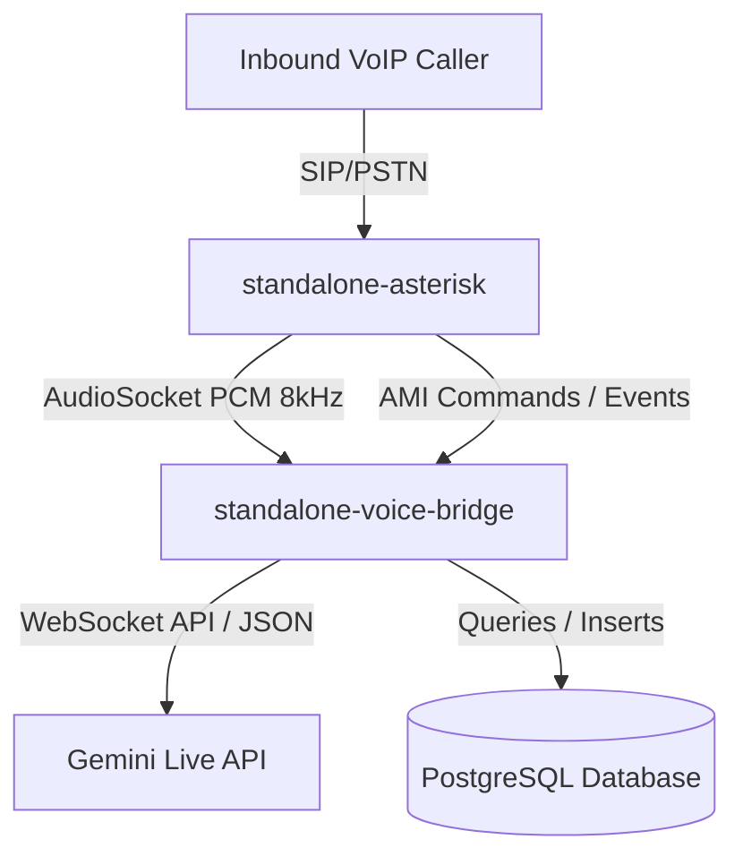

# Codex / AI Agent Handbook for Gemini Live Standalone Stack

Welcome, Agent! This directory contains the standalone Gemini Live voice bridge and Asterisk PBX stack. As an agent, your goal is to manage, troubleshoot, extend, and deploy this AI voice telephony service. Below is a comprehensive operational and architectural reference guide.

---

## 🏗 System Architecture

The stack consists of two primary Docker containers running in the `emareticket-prod_emareticket-prod-net` network:



1. **`standalone-asterisk` (Asterisk 20):**
   - Receives inbound SIP trunk calls.
   - Encodes caller metadata (CallerID and Destination DID) into a custom AudioSocket UUID.
   - Routes audio streams via AudioSocket TCP to the voice bridge.
   - Captures call recordings using `MixMonitor` and performs SIP call transfers.
2. **`standalone-voice-bridge` (Python ASGI Server):**
   - Written in `standalone_bridge.py`.
   - Listens on TCP port `8095` for AudioSocket connections.
   - Connects to the Gemini Live API via WebSockets using the tenant's Google key from `AIProviderConfigs` (decrypted with `ENCRYPTION_KEY`).
   - Resolves tenant configuration (Greeting text, prompts, voices) dynamically from the PostgreSQL database.
   - Declares and processes interactive Python tools (function calling) registered with the Gemini model.

---

## 📂 File Directory Map

* **[compose.yml](file:///Users/emre/elyafgroup/gemini-live-standalone/compose.yml):** Service definitions, environment variables (database connection, Gemini API key, model target), and mounted volumes.
* **[standalone_bridge.py](file:///Users/emre/elyafgroup/gemini-live-standalone/standalone_bridge.py):** The heart of the voice bridge logic (AudioSocket parser, asyncio socket handlers, dynamic prompt loaders, tool callers, and Asterisk AMI actions).
* **[asterisk_config/](file:///Users/emre/elyafgroup/gemini-live-standalone/asterisk_config/):** Configuration folder mounted to Asterisk container's `/etc/asterisk/`.
  * **[pjsip.conf](file:///Users/emre/elyafgroup/gemini-live-standalone/asterisk_config/pjsip.conf):** Configures SIP endpoints, auth, and trunk registrations with Acar Telekom.
  * **[extensions.conf](file:///Users/emre/elyafgroup/gemini-live-standalone/asterisk_config/extensions.conf):** Inbound call routing, custom UUID assembly, consultative transfer routing, and call forwarding.
  * **[musiconhold.conf](file:///Users/emre/elyafgroup/gemini-live-standalone/asterisk_config/musiconhold.conf):** Registers default hold music class pointing to `/etc/asterisk/moh` directory.
  * **[modules.conf](file:///Users/emre/elyafgroup/gemini-live-standalone/asterisk_config/modules.conf):** Explicit module loading whitelist (ensuring `app_audiosocket.so`, `res_pjsip.so`, and `app_mixmonitor.so` load).

---

## 🛢 Metadata & Database Integration

### 1. Inbound UUID Metadata Protocol
To pass call information through AudioSocket's single UUID field, Asterisk encodes the target DID and CallerID into a formatted UUID in `extensions.conf`:
`DID_PART1(8)-DID_PART2(4)-4000-8000-CALLERID(12)`
The bridge parses this UUID to extract `DID` and `CallerID`.

### 2. Tenant Mapping
The bridge queries the `SipTrunks` table to find which `TenantId` owns the dialed `DID`. This is used to load configurations from `Tenants`:
* **`AgentSystemPromptOverride`:** Defines the AI persona instruction prompt.
* **`AgentCustomSettings`:** Dynamic greeting text template (e.g. *"Merhaba {CustomerName}..."*).
* **`AgentVoiceId`:** Pre-mapped voice profile (harci voices are mapped to standard Google prebuilt voices like **`Kore`**).

### 3. Customer Mapping & Honorifics
A lookup is performed on `CustomerContacts` and `Customers`. If a name matches, the bridge checks it against `FEMALE_NAMES`. It appends **"Bey"** or **"Hanım"** automatically in Turkish greetings.

---

## 🛠 Interactive AI Tools (Function Calling)

Gemini Live can invoke the following database and PBX commands during calls:
* **`check_ticket_status()`**: Queries the database for the last 5 active tickets of the caller, returning their stage (Opened, In Progress, Resolved).
* **`create_support_ticket(title, description)`**: Creates a ticket (ID formatted as `ST00000X`), inserts it into `SupportTickets`, logs a `SupportTicketActivities` event, and returns the ticket ID for the AI to announce.
* **`update_ticket(ticket_number, new_stage, note)`**: Updates ticket status.
* **`create_appointment(title, scheduled_at, duration_minutes, description, location)`**: Adds appointments to the database.
* **`create_order(items, shipping_address, notes)`**: Inserts customer order details.
* **`forward_call(phone_number)`**: Instantly redirects the call to an external SIP phone number.
* **`request_consultative_transfer(caller_name, company_name, purpose)`**: Puts the caller on hold with hold music (`hold_music` extension), originates a call to the operator (Öner Bey), starts a secondary AI consultation session to brief the operator, and waits for approval.
* **`confirm_transfer()`**: Invoked by the operator's consultation AI to bridge the caller channel to the operator, removing the AI session cleanly.

---

## 💻 Crucial Commands & Operations

### Build & Run Stack Locally
```bash
docker compose up -d --build
```

### Check Bridge Logs
```bash
docker logs -f standalone-voice-bridge
```

### Access Asterisk CLI (Interactive debug console)
```bash
docker exec -it standalone-asterisk asterisk -rvvv
```

### Reload Configs Live
```bash
docker exec -t standalone-asterisk asterisk -rx "dialplan reload"
docker exec -t standalone-asterisk asterisk -rx "pjsip reload"
docker exec -t standalone-asterisk asterisk -rx "moh reload"
```

---

## 🚀 Production Deployment (IP: 185.189.54.107)

Updates should be copied to the production host `/opt/gemini-live-standalone`. Run these scp/ssh commands to sync and reload:

```bash
# 1. Sync updated files
scp gemini-live-standalone/standalone_bridge.py root@185.189.54.107:/opt/gemini-live-standalone/standalone_bridge.py
scp gemini-live-standalone/compose.yml root@185.189.54.107:/opt/gemini-live-standalone/compose.yml
scp gemini-live-standalone/asterisk_config/extensions.conf root@185.189.54.107:/opt/gemini-live-standalone/asterisk_config/extensions.conf
scp gemini-live-standalone/asterisk_config/pjsip.conf root@185.189.54.107:/opt/gemini-live-standalone/asterisk_config/pjsip.conf

# 2. Recompile and start container stack
ssh root@185.189.54.107 "cd /opt/gemini-live-standalone && docker compose up -d --build --remove-orphans"

# 3. Reload dialplan within container
ssh root@185.189.54.107 "docker exec -t standalone-asterisk asterisk -rx 'dialplan reload'"
```

---

## ⚠️ Known Gotchas & Troubleshooting

1. **Audio Latency / Early Hangup:**
   The bridge executes a `stop_silence_event` and streams silence frames to Asterisk upon client connection. This prevents Asterisk from hanging up during database lookups and Gemini WebSocket Handshakes. **Do not remove the initial silence task.**
2. **Consultative Transfer UUID Versioning:**
   Primary calls use version `4000` inside the custom UUID. When the consultation call is originated to the operator, the consultation UUID is created with version `9000` to distinguish the operator session from the caller session.
3. **Hold Music WAV Audio Format:**
   Asterisk expects hold music files (`hold.wav`) to be in strictly **PCM Mono 8000Hz 16-bit** format. High quality stereo WAVs will sound static or cause Asterisk to error. Downsample files before copying to `/etc/asterisk/moh`.
4. **Postgres DateTime Serialization:**
   Always store timestamps using PostgreSQL-compatible datetime kinds (timezone-aware UTC). Passing unspecified local times to `Npgsql` database drivers causes `500 Runtime Exception` errors.
