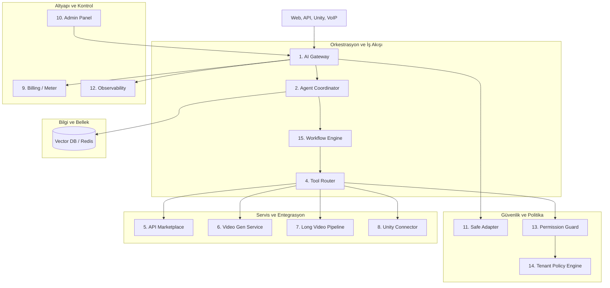

# 🚀 Rapor: EMARE AI NATIVE PLATFORM 10/10 MASTERPLAN

Bu plan, **Emare AI Dashboard** platformunu tamamen yapay zeka yerlisi (AI-Native) bir orkestrasyon ve uygulama platformuna dönüştürmek amacıyla hazırlanmıştır. 

Projenin en kritik üretim (production) güvencesi olan **Gemini Live Standalone Voice Bridge** ses altyapısı bu geçişte tamamen bağımsız kalacak ve hiçbir operasyonel parametresi bozulmayacaktır.

---

## 1. Mevcut Yapı ve Korunacak Ses Sınırları

### Mevcut Durum
* **Voice Bridge:** `gemini-live-standalone/` içinde Asterisk ile AudioSocket TCP port `8095` üzerinden ham PCM ses veri akışıyla doğrudan konuşan, `gemini-2.0-flash-exp` veya `gemini-2.5-flash` Live API'ye WebSocket ile bağlı Python ASGI sunucusu.
* **Text AI:** `src/EmareTicket.AI/` altında e-posta, WhatsApp ve webchat otomasyonlarını yöneten .NET CQRS servisleri.

### 🔒 Korunacak Ses Sınırları (Kesinlikle Değiştirilmeyecekler)
1. **Giriş/Çıkış Portları:** AudioSocket TCP (`8095`) ve macOS Assistant WebSocket (`8096`) portları ve protokol yapıları aynen korunacaktır.
2. **Barge-in RMS Eşiği (`3200`):** Müşteri araya girdiğinde sesi kesen algılama eşiği ve hassasiyeti değiştirilmeyecektir.
3. **Zaman Aşımı (`12s`):** Sessizlik algılama ve güvenlik kapatma zamanlayıcısı 12 saniyede kalacaktır.
4. **Karşılama Koruması (`6.0s`):** Arama başlangıcındaki karşılama anonsu bitene kadar (veya 6.0 saniye geçene kadar) asistanın sözünün kesilmesini önleyen koruma aktif kalacaktır.
5. **Redis Cache:** Tekrarlanan ElevenLabs ses sentezleri ve trunk ayarları için kullanılan Redis bellek yapısı korunacaktır.

---

## 2. Yeni Hedef Mimari

Yeni platform, ses katmanının dışındaki tüm AI operasyonlarını mikroservis tabanlı, esnek ve dinamik bir yapıya taşır:



---

## 3. Servis Servis Detaylı Açıklamalar

### 1. AI Gateway
* **Görevi:** Tüm AI modellerine (Gemini, Grok, ElevenLabs, DeepSeek) giden istekler için tek giriş noktasıdır.
* **Yetenekleri:** Yük dengeleme (load balancing), model bazlı rate limiting, akıllı caching ve anahtar (API Key) havuzu yönetimi.

### 2. Agent Coordinator
* **Görevi:** Çoklu ajan (multi-agent) odalarını yönetir.
* **Yetenekleri:** Ajanların birbirleriyle konuşmasını, sıra alma (turn-taking) mantığını ve Supervisor/Teacher koordinasyonunu yönetir.

### 3. Memory Service
* **Görevi:** Müşterilerin kısa ve uzun vadeli hafızasını yönetir.
* **Yetenekleri:** Vektör veritabanı (Qdrant/Milvus) üzerinden anlamsal arama (semantic search) ve Redis üzerinden anlık oturum state takibi.

### 4. Tool Router
* **Görevi:** Ajanların ürettiği araç çağırma (function call) isteklerini güvenli hedeflere yönlendirir.
* **Yetenekleri:** Dinamik parametre doğrulama ve API şeması eşleme.

### 5. API Marketplace
* **Görevi:** Üçüncü taraf sistemlerin (ERP, CRM, Kargo, SMS) API'lerini platforma "tak-çıkar" (plug-play) şeklinde entegre eder.
* **Yetenekleri:** OpenAPI/Swagger şemalarını okuyup anında ajanın kullanabileceği bir "araca" (tool) dönüştürür.

### 6. Video Generation Service
* **Görevi:** Gerçek zamanlı veya yarı-gerçek zamanlı dijital insan (avatar) üretir.
* **Yetenekleri:** Dudak senkronizasyonu (lip-sync) ile metinden video üretme (HeyGen/Tavus/Simli API'leri üzerinden).

### 7. Long Video Pipeline
* **Görevi:** Asenkron, uzun metrajlı video üretim kuyruğudur.
* **Yetenekleri:** Müşteri raporları veya onboarding süreçleri için arka planda sahne bazlı video birleştirme ve render işlemleri.

### 8. Unity Game Engine Connector
* **Görevi:** 3D oyun motorları veya etkileşimli ekranlar için köprüdür.
* **Yetenekleri:** Ajanların duygu durumlarını (emotional state) ve hareket komutlarını gRPC/WebSocket üzerinden Unity'ye aktarır.

### 9. Billing / Usage Meter
* **Görevi:** AI tüketimini milisaniye, token ve karakter bazında gerçek zamanlı ölçer.
* **Yetenekleri:** Tenant bakiyesinden anlık düşüm ve limit aşımında servis durdurma.

### 10. Admin Control Panel
* **Görevi:** Yönetici arayüzüdür.
* **Yetenekleri:** Ajan promt'ları, model parametreleri, bakiye tanımları ve canlı çağrı izleme ekranları.

### 11. Safe Adapter
* **Görevi:** Model öncesi veri koruma ve filtreleme katmanıdır.
* **Yetenekleri:** KVKK/GDPR uyumlu PII maskeleme ve prompt enjeksiyonu (prompt injection) koruması.

### 12. Observability / Logs / Metrics
* **Görevi:** Tüm platformun performansını izler.
* **Yetenekleri:** Prometheus metrikleri, OpenTelemetry izleri ve merkezi log toplama.

### 13. Permission Guard
* **Görevi:** Ajanların yetki sınırlarını kontrol eder.
* **Yetenekleri:** "Ajan X, veri tabanındaki fatura tablosunu güncelleyebilir mi?" sorusunu rol bazlı (RBAC) doğrular.

### 14. Tenant Policy Engine
* **Görevi:** Kiracı bazlı kural ve sınırları yönetir.
* **Yetenekleri:** Acar Telekom için "asla rakip firma adı anma" veya Elyaf Group için "sadece mesai saatlerinde arama yap" gibi özel kuralları prompt veya filtre seviyesinde zorunlu kılar.

### 15. Workflow Engine
* **Görevi:** Çok adımlı, state'li iş akışlarını yürütür.
* **Yetenekleri:** Ajanın başlattığı bir süreci (örn: "teklif oluştur -> onay al -> fatura kes") adım adım takip eder ve onay mekanizmalarını yönetir.

---

## 4. Detaylı Veri Akışı (Data Flow)

```
Müşteri (Yazılı/Görsel Giriş)
  │
  ▼
AI Gateway (Yetki & Rate Limit Kontrolü)
  │
  ▼
Safe Adapter (Hassas Veri Maskeleme - T.C., Telefon vb.)
  │
  ▼
Agent Coordinator (Ajan Odası - Hangisi yanıt verecek?)
  │
  ├─► Memory Service (Önceki konuşmalar ve Bilgi Tabanı)
  │
  ▼
LLM Çağrısı (Gemini/Grok)
  │
  ▼
Tool Router (Araç Çağırma İsteği: "Fatura oluştur")
  │
  ├─► Permission Guard (Yetki var mı?)
  ├─► Tenant Policy Engine (Kurallara uygun mu?)
  │
  ▼
API Marketplace (İlgili ERP/CRM API'si tetiklenir)
  │
  ▼
Workflow Engine (Akış son adımı tamamlar)
  │
  ▼
Yanıt Üretimi (Yazılı yanıt veya Video/Unity komutu)
  │
  ▼
Billing Meter (Kullanılan token/milisaniye hesaptan düşülür)
```

---

## 5. Güvenlik Sınırları

* **Tenant İzolasyonu:** Her tenant'ın vektör veritabanı namespace'leri ve API anahtarları fiziksel veya mantıksal olarak izole edilecektir. Global anahtar havuzundan sadece yetki dahilinde paylaşım yapılabilir.
* **Safe Adapter Güvencesi:** Hiçbir ham müşteri verisi Safe Adapter'den geçmeden dış LLM sağlayıcılarına (OpenAI, Google) gönderilemez.
* **Ajan Yetki Limitleri:** Ajanlar doğrudan veritabanı bağlantısına sahip olamaz. Sadece Permission Guard tarafından denetlenen API Gateway uç noktalarını tetikleyebilirler.

---

## 6. Tenant ve Billing Modeli

* **Kredi Defteri (Ledger System):** Her tenant'ın bir cüzdanı bulunur.
* **Tüketim Katsayıları:**
  * Gemini 2.5 Flash Girdi: $0.075 / M-token
  * Gemini 2.5 Flash Çıktı: $0.30 / M-token
  * ElevenLabs TTS: $0.15 / 10.000 karakter
  * Video Üretimi: $0.05 / saniye
* **Bakiye Kontrolü:** AI Gateway her istek öncesinde faturalandırma servisinden "kredi yeterli" onayı alır. Yetersiz bakiye durumunda istekler asenkron olarak reddedilir veya fallback statik yanıta yönlendirilir.

---

## 7. Video API Entegrasyon Modeli

Real-time veya asenkron video üretimi için iki hat kurulur:
1. **Interactive (Real-time Stream):** Dudak senkronizasyonlu avatar akışları için WebRTC tabanlı `Simli` veya `Tavus` API entegrasyonu. Ses akışı doğrudan Standalone Voice Bridge'den alınır ve video kareleri senkronize olarak tarayıcıya iletilir.
2. **Pipeline (Asenkron):** `HeyGen` veya `Synthesia` kullanılarak arka planda toplu müşteri tanıtım/rapor videolarının render edilmesi.

---

## 8. Unity Entegrasyon Modeli

* **Haberleşme:** Unity istemcileri Agent Coordinator'a gRPC streams veya WebSockets üzerinden kalıcı bağlantı kurar.
* **Duygu ve Animasyon Senkronizasyonu:** Ajanın yanıtı üretilirken LLM'den dönen metadata (örn: `{ "emotion": "happy", "gesture": "wave" }`) json/protobuf formatında Unity'ye iletilir. Unity motoru bu verilere göre 3D karakterin animasyonunu tetikler.

---

## 9. Geçiş (Migration) ve Rollback Planı

### Geçiş Adımları (Sıfır Kesinti)
1. **Gölge Dağıtım (Shadow Deployment):** Yeni AI Gateway ve Coordinator servisleri kurulur ancak canlı trafik yönlendirilmez.
2. **Paralel Çalıştırma:** Mevcut webchat trafiği hem eski servis üzerinden işlenir hem de yeni AI Gateway'e test amaçlı ("gölge") gönderilerek yanıt tutarlılığı ölçülür.
3. **Kademeli Geçiş:** Trafiğin %10'u yeni platforma kaydırılır. Hata oranları izlenir.
4. **Tam Geçiş:** Trafik %100 yeni platforma taşınır.

### Geri Dönüş (Rollback) Planı
* **Statik Fallback Switch:** AI Gateway üzerinde yaşanacak kritik bir çökme anında, istemciler DNS seviyesinde veya API Gateway yönlendirmesiyle doğrudan eski monolit (.NET backend) AI servis uç noktalarına geri döner.
* **Ses Hattı Güvencesi:** Ses altyapısı bu sistemlerden bağımsız çalıştığı için, yeni servislerin tamamı çökse dahi telefon aramaları kesintisiz olarak Gemini Live ve ElevenLabs ile konuşmaya devam eder (sadece gelişmiş bellek/workflow servisleri geçici olarak devre dışı kalır).

---

## 10. Üretim (Production) Risk Listesi

| Risk Tanımı | Etki Derecesi | Alınacak Önlem |
|---|---|---|
| AI Gateway üzerinde yüksek gecikme (Latency) oluşması | **Kritik** | Redis cache kullanımı ve hafif C# / Go tabanlı Gateway mimarisi. |
| ElevenLabs API limitinin veya kredisinin aniden tükenmesi | **Yüksek** | Gemini TTS'e anlık dinamik fallback mekanizması (audio_injector'de hazır). |
| Ajanın sonsuz döngüye girip kredi tüketmesi | **Yüksek** | Ajan başına maksimum adım (max loops = 5) ve maksimum token limiti sınırı. |
| Hassas verilerin sızması (KVKK ihlali) | **Kritik** | Safe Adapter testlerinin otomatik pipeline'a dahil edilmesi ve maskeleme kurallarının sıkı denetimi. |

---

## 11. Yapılmayacaklar (Do Not Do) Listesi

1. ❌ **Ses Köprüsü Koduna Dokunulmayacak:** `standalone_bridge.py` içindeki port, soket ve ses buffer döngüleri kesinlikle değiştirilmeyecektir.
2. ❌ **Senkron API Bağlantıları Kurulmayacak:** Ajanların üçüncü taraf sistemleri tetiklediği araçlar asla ana ses veya chat kanalını kilitlemeyecek, asenkron veya timeout korumalı olacaktır.
3. ❌ **API Key'ler Kod İçine Yazılmayacak:** Hiçbir API anahtarı veya veritabanı şifresi kod dosyalarında veya masterplan dokümanlarında açık olarak yer almayacaktır.
4. ❌ **Ajanlara Sınırsız Yetki Verilmeyecek:** Ajanlar hiçbir koşulda doğrudan veritabanında `DROP`, `TRUNCATE` veya denetimsiz `DELETE` işlemleri yapabilecek araçlara sahip olamaz.
