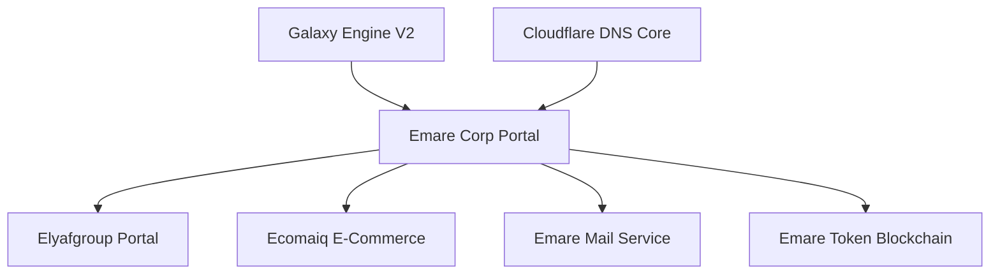

# Emare Corp Çatı Şirketi Web Portali ve Sistem Altyapısı Mimari Tasarım Dokümanı

Bu doküman, çatı şirketimiz **Emare Corp** (`emarecorp.com`) portalinin web mimarisini, bağlı alt iştiraklerin (Elyafgroup, Ecomaiq vb.) ve çekirdek servislerin (Emare Mail, Token vb.) sistem topolojisindeki konumunu ve bu yapıların **Galaxy Engine V2 (Gökada Motoru)** ile görselleştirilmesini tanımlar.

---

## 1. Vizyon ve Çatı Şirket Rolü

**Emare Corp**, tüm otonom yapay zeka operasyonlarının, ağ altyapısının ve ticari modüllerin (E-Ticaret, Lojistik, İletişim) merkezi karar çekirdeğidir. Bu portal, alt şirketlerin operasyonel durumlarını, DNS durumlarını, mail sunucu yüklerini ve ağ topolojisini tek bir "Kozmik Çatı Dashboard" üzerinden yönetir.

---

## 2. Altyapı ve Sunucu Envanteri

Portal ve bağlı servisler, Cloudflare koruması arkasındaki güvenli VM'ler ve dedicated sunucular üzerinde çalışmaktadır.

### 2.1 Domain & DNS Konfigürasyonu
* **Ana Domain**: `https://emarecorp.com` (canlı, 200 OK)
* **Cloudflare Zone ID**: `6775de230d2472d62c8a04da23204a97`
* **DNS A Kaydı**: `185.189.54.104` (Cloudflare Proxied)
* **Origin Web Root**: `/var/www/emarecorp/`
* **Nginx Konfigürasyonu**: `/etc/nginx/conf.d/emarecorp.conf`
* **SSL Sertifikası**: Let's Encrypt (`/etc/letsencrypt/live/emarecorp.com/`)

### 2.2 Bağlı Domainler ve Mikro Servisler
* **API Çekirdeği**: `api.emarecloud.tr`
* **Token Servisi**: `token.emarecloud.tr`
* **E-Ticaret Operasyonları**: `ecomaiq.com`
* **Lojistik ve Tedarik**: `elyafgroup.emarecloud.tr`

---

## 3. Dedicated E-Posta Altyapısı (Emare-Mail)

Emare Corp, tüm alt iştiraklerin kurumsal haberleşmesini dedicated bir mail sunucusu (`31.169.72.82`) üzerinden yönetir.

| Protokol / Alt Domain | Hedef Sunucu | Durum |
| --------------------- | ------------ | ----- |
| `mail.emarecorp.com`  | `31.169.72.82` (DNS only) | Aktif (Mailcow) |
| `imap` / `pop3` / `smtp` | `31.169.72.82` | SSL/TLS Aktif |
| MX Kaydı | `mail.emarecorp.com` | Öncelik: 10 |
| SPF Tanımı | `v=spf1 ip4:31.169.72.82 ~all` | Doğrulandı |
| DKIM İmzası | `dkim._domainkey.emarecorp.com` | Aktif |

* **Sunucu Yönlendirmesi**: `31.169.72.82` IP'sine gelen SMTP/IMAP istekleri, DNAT ile dahili ağdaki `192.168.10.8` (Emare-Mail-83) VM'ine yönlendirilir.

---

## 4. Galaxy Engine V2 Çatı Entegrasyonu

Emare Corp web portalinde, tüm alt şirketler ve servisler yaşayan birer **Gökada (Galaxy)** şeklinde görselleştirilir.

### 4.1 Gökada Seviyeleri (LOD)
1. **Çatı Gökada Görünümü (LOD 0)**: Merkezde devasa bir parlak kozmik güneş (Emare Corp) yer alır. Yörüngesinde dönen 4 ana gökada spirali bulunur:
   * **Elyafgroup Gökadası** (Mavi Spiral): Tedarik zinciri, lojistik ve üretim gezegenlerini barındırır.
   * **Ecomaiq Gökadası** (Turuncu Spiral): E-ticaret sipariş, kargo ve ödeme gezegenlerini barındırır.
   * **Emare Cloud Gökadası** (Yeşil Spiral): API sunucuları, token servisleri ve veritabanı gezegenlerini barındırır.
   * **Mail Services Gökadası** (Mor Spiral): MX sunucuları, SMTP/IMAP kuyruk gezegenlerini barındırır.
2. **Sistem Sağlık Işımaları**: Cloudflare API'sinden gelen anlık trafik ve CPU/RAM telemetry verileri, ilgili spiral gezegenlerin etrafında neon renkli yörünge halkaları (Corona Rings) ve 3D parçacık efektleri olarak yansıtılır.
3. **Kuyruklu Yıldız (Canlı Event) Trafiği**: Alt gökadalar arasında akan veri paketleri, solar rüzgarlar ve parıldayan kuyruklu yıldızlar (comets) halinde yörüngeler arası süzülür.

---

## 5. Çevrimdışı Çalışma (Offline-First) & Güvenlik Politikaları

Corporate portal, en zorlu ağ koşullarında dahi üst düzey yönetici ekranlarının sıfır gecikmeyle açılması için offline-first Service Worker mimarisini barındırır:
* **M mascot ve 3D Modellerin Önbelleklenmesi**: `golden+logo+emblem+3d+model.glb` gibi ağır 3D logolar ve assetler, PWA Service Worker aracılığıyla Cache API'ye alınır ve persistent storage izni ile cihazda kalıcı olarak saklanır.
* **DNS Fallback**: Cloudflare ve Nginx logları, yerel IndexedDB veritabanında depolanarak internet kesildiğinde son senkronize edilen ağ durumunu göstermeye devam eder.
