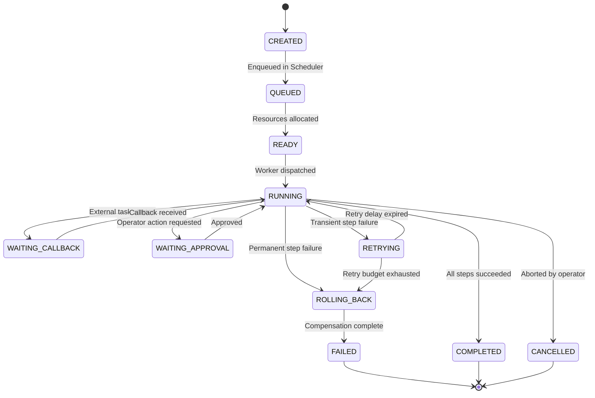

# ⚙️ Execution Runtime Engine (ERE) Specification

**Title:** Execution Runtime Engine & Connector Specs  
**Task Code:** TASK_CT_007  
**Status:** Approved for Implementation  
**Owner:** Principal Platform Architect  
**Last Updated:** 2026-07-11  

---

## 1. Overview & Operational Pipeline

The **Execution Runtime Engine (ERE)** is the ultimate reliability layer of the Emare Operating System (EOS) Control Tower. It receives decision blueprints from the Coordination Layer (Platform Orchestrator) and guarantees transactional safety, step-by-step checkpoints, transient failure recovery, and idempotency boundaries.

```mermaid
graph TD
    Decision[Platform Decision Snapshot] --> Orchestrator[Platform Orchestrator]
    Orchestrator --> ERE[Execution Runtime Engine]
    
    subgraph ERE-Core [Execution Reliability & Safety]
        ERE --> Queue[Execution Queue]
        ERE --> Retry[Retry & Timeout Manager]
        ERE --> Checkpoint[Checkpoint & Resume Manager]
        ERE --> CB[Circuit Breaker]
        ERE --> Idempotency[Idempotency Manager]
        ERE --> DLQ[Dead Letter Queue]
    end

    ERE --> Connectors[Connector Runtime Interfaces]
    Connectors --> Git[IGitHubRuntime]
    Connectors --> Phone[IAsteriskRuntime]
    Connectors --> Email[IEmailRuntime]
end
```

---

## 2. Execution State Machine & Lifecycle

Each workflow execution transitions through these specific states:



---

## 3. Reliability & Policy Parameters

### 3.1. Retry Policy
- **Transient Failures**: Network timeouts, database lock concurrency, or API rate-limits are classified as transient and scheduled for retries using exponential backoff with jitter:
  $$\text{Delay} = \text{RetryDelay} \times 2^{\text{Attempt}} + \text{Jitter}$$
- **Permanent Failures**: Logic errors, validation exceptions, or invalid security permissions bypass retries and directly trigger the `Compensation / Rollback` phase.

### 3.2. Checkpoint & Resume
Before executing any step, the ERE writes a `Checkpoint` snapshot tracking:
- Current step index.
- Output from previous steps.
- Inputs for the current step.
If a worker crashes or is restarted, the scheduler reads the last successful checkpoint and resumes execution from that step, preventing duplicate side-effects.

### 3.3. Idempotency Boundary
All step invocations require an `IdempotencyKey` formatted as:
$$\text{Key} = \text{ExecutionId} + \text{StepName} + \text{OperationId}$$
If a duplicate request is received, the ERE returns the cached output from the checkpoint store without executing side-effects on the connector.

---

## 4. Standard DTOs & Service Contracts

### 4.1. C# Execution Snapshot DTOs
```csharp
namespace EmareTicket.Contracts.Elyaf;

using System;
using System.Collections.Generic;

public class ExecutionSnapshotDto
{
    public string ExecutionId { get; set; } = string.Empty;
    public string DecisionId { get; set; } = string.Empty;
    public string IdempotencyKey { get; set; } = string.Empty;
    public string State { get; set; } = "CREATED"; // CREATED | QUEUED | RUNNING | WAITING_CALLBACK | FAILED | COMPLETED
    public List<ExecutionStepDto> Steps { get; set; } = new();
    public ExecutionTelemetryDto Telemetry { get; set; } = new();
}

public class ExecutionStepDto
{
    public string StepName { get; set; } = string.Empty;
    public string ConnectorType { get; set; } = string.Empty;
    public string Status { get; set; } = "PENDING";
    public string InputPayloadJson { get; set; } = "{}";
    public string OutputPayloadJson { get; set; } = "{}";
    public int RetryCount { get; set; }
    public string ErrorMessage { get; set; } = string.Empty;
}

public class ExecutionTelemetryDto
{
    public double DurationMs { get; set; }
    public double QueueTimeMs { get; set; }
    public int ActiveRetryCount { get; set; }
    public string WorkerId { get; set; } = string.Empty;
}
```

### 4.2. Connector Runtime Interfaces
```csharp
namespace EmareTicket.Application.Abstractions.Elyaf;

using System.Threading;
using System.Threading.Tasks;

public interface IGitHubRuntime { Task<string> CreateIssueAsync(string repo, string title, string body, CancellationToken ct); }
public interface IWhatsAppRuntime { Task<bool> SendMessageAsync(string phone, string message, CancellationToken ct); }
public interface IEmailRuntime { Task<bool> SendMailAsync(string to, string subject, string body, CancellationToken ct); }
public interface ICrmRuntime { Task<string> CreateTaskAsync(string title, string priority, CancellationToken ct); }
public interface IAsteriskRuntime { Task<string> TriggerCallAsync(string ext, string ttsText, CancellationToken ct); }
public interface ICloudRuntime { Task<bool> ScaleResourceAsync(string resourceId, int capacity, CancellationToken ct); }
```
