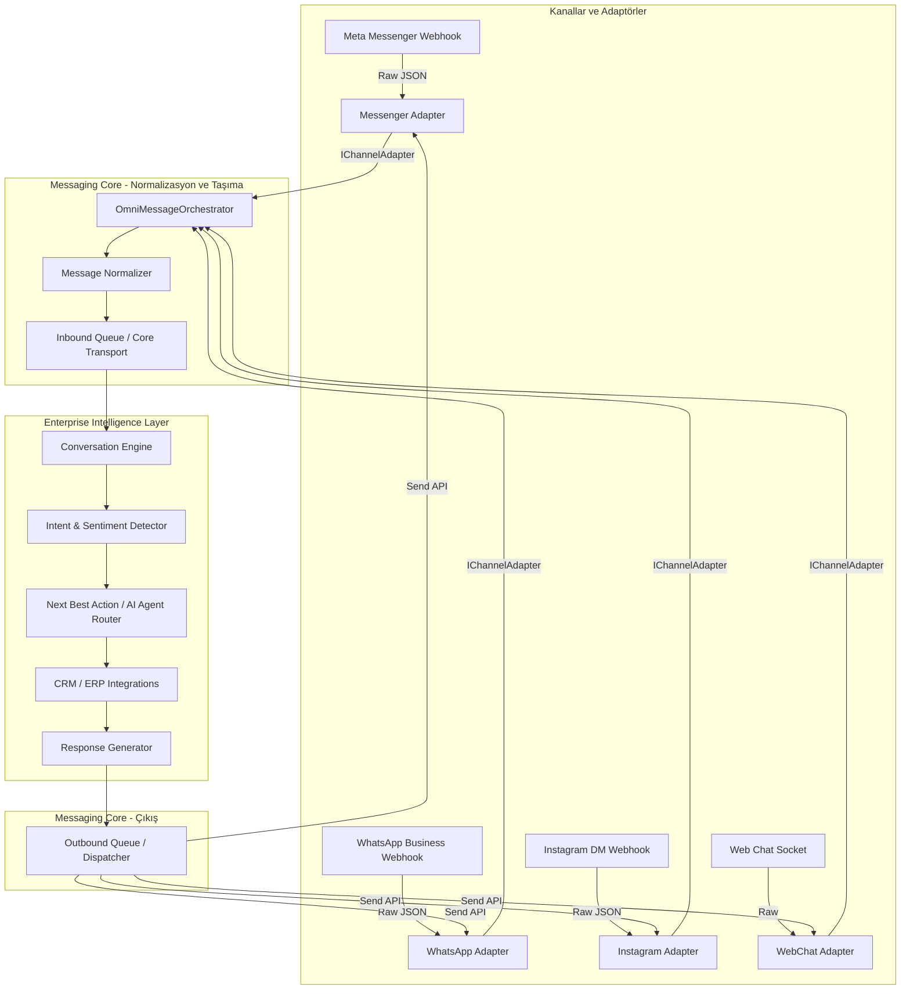

# 🌐 Omnichannel Messaging Core (OMC) Mimarisi

**Title:** Omnichannel Messaging Core (OMC) Mimarisi  
**Version:** 1.1.0  
**Status:** Under Review (Approved with Modifications)  
**Owner:** Architecture Board  
**Last Updated:** 2026-07-10  
**Dependencies:** DOMAIN_MODEL.md  
**Related Documents:** EVENT_BUS.md, ANAYASA.md  

---

## 1. Giriş ve Sorumluluk Dağılımı

Bu doküman, Emare BOS üzerindeki tüm kanal entegrasyonlarını (Facebook Messenger, WhatsApp, Instagram DM, Web Live Chat, E-posta, Telegram vb.) kanaldan bağımsız bir taşıma altyapısında birleştiren **Omnichannel Messaging Core (OMC)** mimarisini tanımlar.

### 1.1. Kesin Sorumluluk Sınırı (De-coupling)
Mimarinin en kritik ilkesi, **Messaging Core'un sadece bir taşıyıcı (Transport & Normalization)** olarak konumlandırılmasıdır. 
* **OMC (Agent 11 Sorumluluğu):** Webhook yönetimi, imza doğrulama, rate limiting, kanal sağlığı, mesaj normalleştirme, kuyruklama, gönderme (Send API) ve hata telafi (retry) süreçlerini yönetir. Karar verici veya iş mantığı katmanı **değildir**.
* **Enterprise Intelligence & AI (Diğer Ajanlar / Servisler):** Duygu analizi, niyet motoru (Intent Classifier), bellek (Memory), ERP/CRM entegrasyonu, Next Best Action ve cevap üretimi (LLM) tamamen OMC'nin dışındaki bağımsız servislerce yürütülür.

---

## 2. Mimari Tasarım & Akış

OMC, her kanaldan gelen ham paketleri standart bir zarfa (envelope) çevirir ve Enterprise Intelligence Engine'e gönderir. Dışarıdan gelen yanıtları da ilgili kanal adaptörü vasıtasıyla müşteriye iletir.

### 2.1. İletişim Akış Diyagramı



---

## 3. Bileşenler ve Arayüzler

### 3.1. Mesaj Normalleştirme (Message Normalizer)
Tüm giriş/çıkış verileri tek bir standarda indirgenir.

```csharp
public enum OmniChannelType
{
    WebWidget = 1,
    WhatsApp = 2,
    Email = 3,
    Messenger = 4,
    Instagram = 5,
    Telegram = 6
}

public enum OmniMessageType
{
    Text = 1,
    Image = 2,
    Video = 3,
    Audio = 4,
    Document = 5,
    Location = 6,
    InteractiveResponse = 7, // Buton/Menü seçimi
    System = 8,
    Note = 9
}

public sealed class InboundMessageEnvelope
{
    public string ExternalMessageId { get; set; } = string.Empty;
    public string ExternalConversationId { get; set; } = string.Empty;
    public string SenderId { get; set; } = string.Empty; // PSID, Phone, Email
    public string RecipientId { get; set; } = string.Empty; // Meta Page ID, WABA ID
    public OmniChannelType Channel { get; set; }
    public OmniMessageType MessageType { get; set; }
    public string? Content { get; set; }
    public string? MediaUrl { get; set; }
    public string? MediaMimeType { get; set; }
    public Dictionary<string, string> Metadata { get; set; } = new();
    public DateTime OccurredAt { get; set; } = DateTime.UtcNow;
}
```

```csharp
public interface IChannelAdapter
{
    OmniChannelType Channel { get; }
    Task<InboundMessageEnvelope> NormalizeInboundAsync(object rawPayload, CancellationToken ct);
    Task<Result<string>> SendOutboundAsync(OutboundMessageEnvelope envelope, CancellationToken ct);
}
```

---

## 4. Kanal Bağımsız Veri Modeli (Unified Conversation Store)

Konuşmalar kanallara göre bölünmez. Müşterinin tüm iletişim geçmişi (farklı kanallardan gelse dahi) tek bir `Conversation` çatısı altında birleşebilir.

```csharp
public class Conversation : AuditableEntity, ITenantEntity
{
    public Guid? TenantId { get; set; }
    public Guid? CustomerId { get; set; }            // Bağlı CRM Cari kartı
    public Guid? AssignedUserId { get; set; }         // Atanan insan operatör
    public Guid? ActiveSupportTicketId { get; set; }  // Bağlı aktif ticket
    
    public ConversationStatus Status { get; set; } = ConversationStatus.Open;
    public DateTime LastMessageAt { get; set; }
    public string? LastMessagePreview { get; set; }
    public int UnreadCount { get; set; }
    
    public Customer? Customer { get; set; }
    public User? AssignedUser { get; set; }
    public SupportTicket? ActiveSupportTicket { get; set; }
    
    public ICollection<ConversationParticipant> Participants { get; set; } = new List<ConversationParticipant>();
    public ICollection<ConversationChannel> Channels { get; set; } = new List<ConversationChannel>();
    public ICollection<ConversationMessage> Messages { get; set; } = new List<ConversationMessage>();
    public ICollection<ConversationAIAnalysis> AIAnalyses { get; set; } = new List<ConversationAIAnalysis>();
}

// Konuşmaya dahil olan kanallar (Örn: Müşteri hem WhatsApp hem Messenger ile katılmış olabilir)
public class ConversationChannel : BaseEntity, ITenantEntity
{
    public Guid? TenantId { get; set; }
    public Guid ConversationId { get; set; }
    public OmniChannelType Channel { get; set; }
    public string ChannelExternalId { get; set; } = string.Empty; // PSID, Phone num vb.
    public bool IsActive { get; set; } = true;
    
    public Conversation Conversation { get; set; } = null!;
}

// Konuşma katılımcıları (Müşteri kontakları, temsilciler vb.)
public class ConversationParticipant : BaseEntity, ITenantEntity
{
    public Guid? TenantId { get; set; }
    public Guid ConversationId { get; set; }
    public Guid? UserId { get; set; }                 // Sistem kullanıcısı (Temsilci) ise
    public Guid? ContactId { get; set; }              // CRM Kişi (Contact) ise
    public string Role { get; set; } = "participant"; // owner, agent, visitor
    
    public Conversation Conversation { get; set; } = null!;
    public User? User { get; set; }
}

public class ConversationMessage : BaseEntity, ITenantEntity
{
    public Guid? TenantId { get; set; }
    public Guid ConversationId { get; set; }
    public string ExternalMessageId { get; set; } = string.Empty;
    public OmniChannelType Channel { get; set; }      // Hangi kanaldan iletildiği/alındığı
    
    public MessageDirection Direction { get; set; }   // Inbound = 1, Outbound = 2
    public OmniMessageType MessageType { get; set; }
    public string? Content { get; set; }
    
    public Guid? SentByUserId { get; set; }          // Gönderen temsilci / system bot ID
    public DateTime CreatedAt { get; set; }
    public DateTime? ReadAt { get; set; }
    
    public Conversation Conversation { get; set; } = null!;
    public ICollection<ConversationAttachment> Attachments { get; set; } = new List<ConversationAttachment>();
}

public class ConversationAttachment : BaseEntity, ITenantEntity
{
    public Guid? TenantId { get; set; }
    public Guid MessageId { get; set; }
    public string AttachmentUrl { get; set; } = string.Empty;
    public string? MimeType { get; set; }
    public long? FileSize { get; set; }
    
    public ConversationMessage Message { get; set; } = null!;
}

// Conversation Intelligence katmanının analiz logları (Örn: Sentiment, Summary, Tags)
public class ConversationAIAnalysis : BaseEntity, ITenantEntity
{
    public Guid? TenantId { get; set; }
    public Guid ConversationId { get; set; }
    public string Sentiment { get; set; } = "neutral";
    public string? Summary { get; set; }
    public string? KeyExtracts { get; set; }          // JSON formatında çıkarılan önemli parametreler
    public DateTime AnalyzedAt { get; set; }
    
    public Conversation Conversation { get; set; } = null!;
}
```

---

## 5. İş Bölümü & Yol Haritası (EPIC_MSG_001)

Süreci **12 alt görev** halinde planlıyoruz. Agent 11 olarak bizim birincil sorumluluğumuz kanal katmanlarının inşası ve entegrasyonudur.

* **TASK_MSG_001 — Messaging Gateway:** Webhook giriş noktaları, rate limiting, signature validation (imza doğrulama) ve retry kuyruğu.
* **TASK_MSG_002 — Conversation Store:** Unified kanal bağımsız veri modelinin (`Conversation`, `ConversationMessage` vb.) Persistence katmanında kurulması ve migration'ı.
* **TASK_MSG_003 — Message Normalizer:** `InboundMessageEnvelope` ve `IChannelAdapter` normalleştirme mantığının kurulması.
* **TASK_MSG_004 — Agent Router:** Mesajları Enterprise Intelligence servislerine yönlendiren, temsilci durumlarına göre dağıtan yönlendirici modül.
* **TASK_MSG_005 — Policy Guard:** Inbound/Outbound seviyesinde finansal/sözleşmesel ve güvenlik kurallarının denetlenmesi.
* **TASK_MSG_006 — Messenger Adapter:** Meta Developer Portal entegrasyonu ve Messenger Page API entegrasyonu.
* **TASK_MSG_007 — Instagram Adapter:** Instagram Graph / Direct API adaptörü.
* **TASK_MSG_008 — WhatsApp Adapter:** Mevcut legacy WhatsApp entegrasyonunun yeni soyutlama modeline (OMC) taşınması.
* **TASK_MSG_009 — Web Chat Adapter:** Mevcut canı destek widget soket sisteminin OMC altyapısına bağlanması.
* **TASK_MSG_010 — Human Inbox:** Temsilci arayüzü ve SignalR soket altyapısının omnichannel modeline uyarlanması.
* **TASK_MSG_011 — Audit Log:** Mesajlaşma işlemlerinin, hata günlüklerinin ve güvenlik ihlallerinin loglanması.
* **TASK_MSG_012 — Timeline Sync:** Görüşme akışlarının ve müşteri eylemlerinin otomatik CRM Timeline verilerine işlenmesi.
