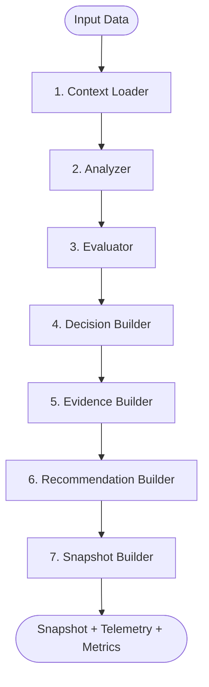
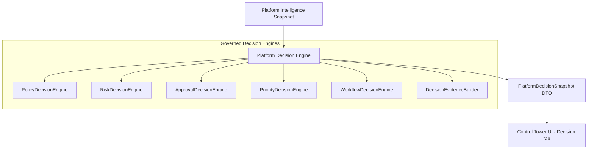
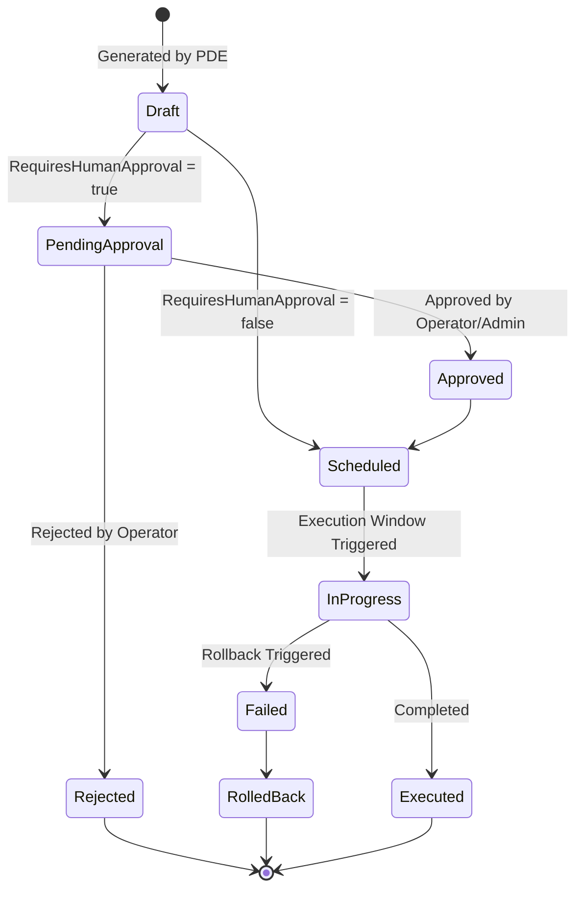

# ⚖️ Platform Decision Engine (PDE) & Engine Framework Specification

**Title:** Platform Decision Engine & Engine Standard Specifications  
**Task Code:** TASK_CT_005  
**Status:** Approved for Implementation  
**Owner:** Principal Platform Architect  
**Last Updated:** 2026-07-11  

---

## 1. Engine Framework Standard (EFS)

To establish architectural homogeneity across the Emare Operating System (EOS), every future engine (Product Twin Engine, Platform Intelligence Engine, Platform Decision Engine, etc.) must follow a strict, standardized execution lifecycle. 



### 1.1. Standard Lifecycle Phases
1. **Context Loader**: Gathers dependent state, configurations, and metadata related to the input scope.
2. **Analyzer**: Parses raw data structures and identifies key metrics, trends, and variables.
3. **Evaluator**: Compares metrics against governed thresholds and policies.
4. **Decision Builder**: Computes potential operational decisions based on evaluator outputs.
5. **Evidence Builder**: Compiles audit logs, raw data snapshots, and references verifying *why* decisions were made.
6. **Recommendation Builder**: Generates actionable, prioritized mitigation steps.
7. **Snapshot Builder**: Aggregates the results into a unified, version-controlled DTO.

### 1.2. Base Engine Contracts in C#
```csharp
namespace EmareTicket.Application.Abstractions.EngineFramework;

using System.Threading;
using System.Threading.Tasks;

public interface IEngineSnapshot
{
    string ScopeId { get; }
    DateTime GeneratedAt { get; }
    double Confidence { get; }
    string Health { get; }
    List<string> EvidenceReferences { get; }
    List<string> Warnings { get; }
    List<string> Recommendations { get; }
}

public interface IEngine<in TInput, TOutput> where TOutput : IEngineSnapshot
{
    Task<TOutput> ExecuteAsync(TInput input, CancellationToken ct = default);
}
```

---

## 2. Platform Decision Engine (PDE) Architecture

The Platform Decision Engine (PDE) sits directly on top of the Platform Intelligence Engine (PIE). It consumes the `PlatformIntelligenceSnapshot` and translates intelligence indicators (e.g. degrading QA health, security warning flags) into governed, executable **Decision Plans**. 

The PDE is strictly **non-executable**. It never triggers NATS webhooks, calls docker orchestration, or sends emails. It only produces governed blueprints (`PlatformDecisionSnapshot`) for downstream orchestrators or human approval.



### 2.1. Decision State Machine & Lifecycle
Each Decision follows a strict state transition flow managed by the downstream orchestrator but defined in the plan:



---

## 3. Standard Contracts & DTOs

### 3.1. C# Decision Snapshot Contract
```csharp
namespace EmareTicket.Contracts.Elyaf;

using System;
using System.Collections.Generic;
using EmareTicket.Application.Abstractions.EngineFramework;

public class PlatformDecisionSnapshotDto : IEngineSnapshot
{
    public string ScopeId => ProductId;
    public string ProductId { get; set; } = string.Empty;
    public DateTime GeneratedAt { get; set; } = DateTime.UtcNow;
    public double Confidence { get; set; }
    public string Health { get; set; } = "Healthy";
    public List<string> EvidenceReferences { get; set; } = new();
    public List<string> Warnings { get; set; } = new();
    public List<string> Recommendations { get; set; } = new();
    
    public List<PieDecisionPlanDto> Decisions { get; set; } = new();
    public PieEngineTelemetryDto Telemetry { get; set; } = new();
}

public class PieDecisionPlanDto
{
    public string DecisionId { get; set; } = string.Empty;
    public string DecisionType { get; set; } = "NO_ACTION"; // NO_ACTION | MONITOR | RECOMMEND | CREATE_TASK | CREATE_GITHUB_ISSUE | REQUEST_APPROVAL | AUTO_EXECUTE | BLOCK_RELEASE | ESCALATE
    public string Priority { get; set; } = "Low"; // Low | Medium | High | Critical
    public string Severity { get; set; } = "Low";
    public double Confidence { get; set; }
    public string Reason { get; set; } = string.Empty;
    public string Evidence { get; set; } = string.Empty;
    public string RecommendedWorkflow { get; set; } = string.Empty;
    public bool RequiresHumanApproval { get; set; }
    public string ApprovalPolicy { get; set; } = "Default"; // Default | DoubleSignature | AdminOverride
    public string ExecutionWindow { get; set; } = "Immediate"; // Immediate | MaintenanceWindow | NextSprint
    public DateTime Expiration { get; set; }
    public string RollbackPlan { get; set; } = string.Empty;
    public string DecisionState { get; set; } = "Draft"; // Draft | PendingApproval | Scheduled | InProgress | Executed | Failed | RolledBack
}

public class PieEngineTelemetryDto
{
    public double ExecutionDurationMs { get; set; }
    public int EvaluationRuleCount { get; set; }
    public string EngineVersion { get; set; } = "1.0.0";
}
```

### 3.2. C# Decision Engine Sub-interfaces
```csharp
namespace EmareTicket.Application.Abstractions.Elyaf;

using System.Threading;
using System.Threading.Tasks;
using EmareTicket.Contracts.Elyaf;

public interface IPlatformDecisionEngine
{
    Task<PlatformDecisionSnapshotDto> ComputeDecisionsAsync(string productId, CancellationToken ct = default);
}

public interface IPolicyDecisionEngine { Task<List<PieDecisionPlanDto>> EvaluatePoliciesAsync(PlatformIntelligenceSnapshotDto intel, CancellationToken ct); }
public interface IRiskDecisionEngine { Task<List<PieDecisionPlanDto>> EvaluateRisksAsync(PlatformIntelligenceSnapshotDto intel, CancellationToken ct); }
public interface IApprovalDecisionEngine { Task<List<PieDecisionPlanDto>> EvaluateApprovalsAsync(PlatformIntelligenceSnapshotDto intel, CancellationToken ct); }
public interface IPriorityDecisionEngine { Task<List<PieDecisionPlanDto>> EvaluatePrioritiesAsync(PlatformIntelligenceSnapshotDto intel, CancellationToken ct); }
public interface IWorkflowDecisionEngine { Task<List<PieDecisionPlanDto>> EvaluateWorkflowsAsync(PlatformIntelligenceSnapshotDto intel, CancellationToken ct); }
```

---

## 4. UI tab panel integration
The Control Tower Product Twin page is extended with a new tab: **`Platform Decisions`** rendering:
* Overall Decision metrics (Execution duration, Rule counts).
* Dynamic Interactive Decision Cards:
  * Decision action, Category (Escalate, Block Release, Request Approval).
  * Expiration timer, Rollback Plan details.
  * Governance parameters: requires signature, approval policy (DoubleSignature).
  * Evidence summaries.
