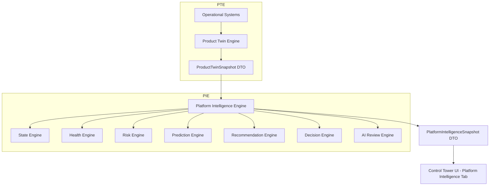

# 🧠 Platform Intelligence Engine (PIE) Specification

**Title:** Platform Intelligence Engine (PIE) Specification  
**Task Code:** TASK_CT_003  
**Status:** Approved for Implementation  
**Owner:** Principal Platform Architect  
**Last Updated:** 2026-07-11  

---

## 1. Overview & Conceptual Architecture

The **Platform Intelligence Engine (PIE)** acts as the analytical and decision-support layer built directly on top of the **Product Twin Engine (PTE)**. 

While the PTE aggregates and exposes operational reality via `ProductTwinSnapshot`, the PIE consumes this snapshot to calculate predictions, risk factors, prioritized engineering recommendations, and explainable operational decisions. This separation guarantees that operational monitoring is decoupled from cognitive/analytical intelligence.



---

## 2. Standard Intelligence Contract (`PlatformIntelligenceSnapshot`)

The backend returns a unified Intelligence DTO. Below is the C# contract specification:

```csharp
namespace EmareTicket.Contracts.Elyaf;

using System;
using System.Collections.Generic;

public class PlatformIntelligenceSnapshot
{
    public string ProductId { get; set; } = string.Empty;
    public string CurrentState { get; set; } = "Active"; // "Active" | "Maintenance" | "Decommissioned"
    public string LifecycleStage { get; set; } = "MVP"; // "Concept" | "MVP" | "Scale" | "Mature"
    public string Health { get; set; } = "Healthy"; // "Healthy" | "Warning" | "Critical" | "Recovering" | "Growing"
    public double Confidence { get; set; }
    public DateTime GeneratedTime { get; set; }
    public PieHealthBreakdown HealthBreakdown { get; set; } = new();
    public List<PieRiskMetric> Risks { get; set; } = new();
    public PiePredictionSummary Prediction { get; set; } = new();
    public List<PieRecommendationItem> Recommendations { get; set; } = new();
    public List<PieOperationalDecision> Decisions { get; set; } = new();
    public List<string> EvidenceReferences { get; set; } = new();
}

public class PieHealthBreakdown
{
    public string Engineering { get; set; } = "Healthy"; // "Healthy" | "Warning" | "Critical"
    public string Tests { get; set; } = "Healthy";
    public string Deployments { get; set; } = "Healthy";
    public string Telemetry { get; set; } = "Healthy";
    public string Ai { get; set; } = "Healthy";
    public string Documentation { get; set; } = "Healthy";
}

public class PieRiskMetric
{
    public string Id { get; set; } = string.Empty;
    public string Level { get; set; } = "Low"; // "Low" | "Medium" | "High" | "Critical"
    public string Category { get; set; } = "Security"; // "Security" | "Performance" | "Stability" | "Documentation"
    public string Impact { get; set; } = string.Empty;
    public string Recommendation { get; set; } = string.Empty;
}

public class PiePredictionSummary
{
    public double CurrentVelocity { get; set; } // tasks or commits per sprint
    public string RemainingWork { get; set; } = string.Empty;
    public string EstimatedMvp { get; set; } = string.Empty;
    public string EstimatedProduction { get; set; } = string.Empty;
    public double PredictionConfidence { get; set; }
    public List<string> BlockedFeatures { get; set; } = new();
    public List<string> FutureRisks { get; set; } = new();
}

public class PieRecommendationItem
{
    public string Priority { get; set; } = "Medium"; // "Critical" | "High" | "Medium" | "Low"
    public string Message { get; set; } = string.Empty;
    public string AffectedComponent { get; set; } = string.Empty;
    public string Action { get; set; } = string.Empty;
}

public class PieOperationalDecision
{
    public string DecisionType { get; set; } = "None"; // "Deploy" | "Rollback" | "FocusQA" | "Scale" | "StopFeatures"
    public string Action { get; set; } = string.Empty;
    public string Reason { get; set; } = string.Empty;
    public double Confidence { get; set; }
    public string Evidence { get; set; } = string.Empty;
    public List<string> AffectedComponents { get; set; } = new();
}
```

---

## 3. Engine Interfaces & Provider Abstractions

The central `PlatformIntelligenceEngine` orchestrates sub-engines using dependency injection.

```csharp
namespace EmareTicket.Application.Abstractions.Elyaf;

using System.Threading;
using System.Threading.Tasks;
using EmareTicket.Contracts.Elyaf;

public interface IPlatformIntelligenceEngine
{
    Task<PlatformIntelligenceSnapshot> GetIntelligenceAsync(string productId, CancellationToken ct = default);
}

public interface IPieStateEngine { Task<string> CalculateStateAsync(ElyafProductTwinDto twin); }
public interface IPieHealthEngine { Task<string> CalculateHealthAsync(ElyafProductTwinDto twin); }
public interface IPieRiskEngine { Task<List<PieRiskMetric>> AnalyzeRisksAsync(ElyafProductTwinDto twin); }
public interface IPiePredictionEngine { Task<PiePredictionSummary> PredictTimelineAsync(ElyafProductTwinDto twin); }
public interface IPieRecommendationEngine { Task<List<PieRecommendationItem>> GenerateRecommendationsAsync(ElyafProductTwinDto twin); }
public interface IPieDecisionEngine { Task<List<PieOperationalDecision>> GenerateDecisionsAsync(ElyafProductTwinDto twin); }
```

---

## 4. Implementation Steps & Migration Plan

### Phase 1: Engine Implementation
Implement `IPlatformIntelligenceEngine` and the sub-engines inside `src/EmareTicket.Infrastructure/Services/Elyaf/`. The engine queries `IProductTwinEngine` to retrieve the current `ElyafProductTwinDto` and performs evaluation rules (e.g. if `twin.Progress.Qa` < 60, issue a prioritized recommendation to "Focus on QA tests before deploying features").

### Phase 2: API Endpoints
Register `IPlatformIntelligenceEngine` and expose Route `GET /api/v1/elyaf/platform-intelligence/{productId}` inside `ElyafProductTwinController.cs`.

### Phase 3: Frontend Refactoring
- **Client Adaptations**: Fetch the intelligence DTO via React Query `usePlatformIntelligence(productId)` inside `useElyafDashboard.ts`.
- **UI Tab Panel**: Integrate the **Platform Intelligence** tab in `ProductTwinView.tsx` with high-fidelity, explainable UI cards mapping current state, health breakdown, prediction matrices, prioritized recommendations, and decision logs.

---

## 5. Verification & Testing Strategy

1. **Unit Tests**:
   * Mock `IProductTwinEngine` to return specific DTO parameters (e.g. low test coverage, high tech debt) and assert that `IPlatformIntelligenceEngine` correctly raises risks and produces matching operational decisions.
2. **TypeScript Build Verification**:
   * Validate Next.js build compilation with `npm run build` and linter tests.
