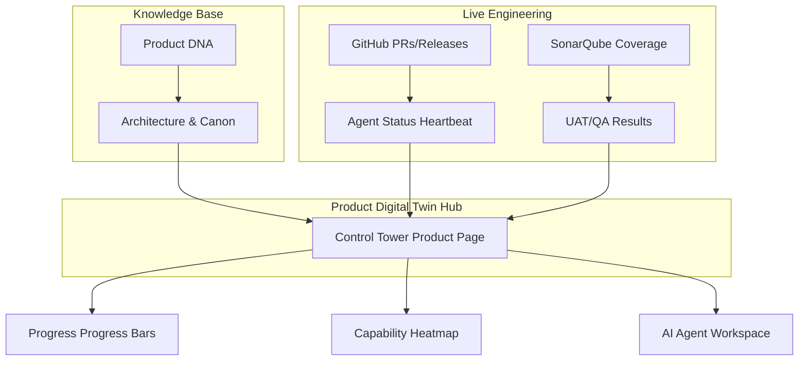
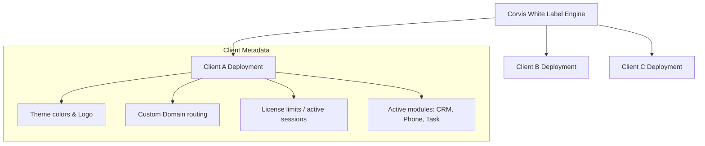

# 🧬 Product Digital Twin (PDT) Framework & Control Tower Integration

**Title:** Product Digital Twin (PDT) Framework  
**Version:** 1.0.0  
**Status:** Proposal / Under Review  
**Owner:** Product Architecture Board  
**Last Updated:** 2026-07-11  

---

## 1. Vision & Architecture

The **Product Digital Twin (PDT)** paradigm models software products not just as static code bases, but as active, living entities possessing their own identity, execution metrics, AI agent bounds, and business rationale. 

By standardizing every product (e.g., *SuperApp*, *Corvis*, *Voice Platform*) into a unified PDT schema, the **Control Tower** transitions from a simple dashboard into a central coordinator for multi-agent execution, compliance audits, and business intelligence tracking.



---

## 2. Unified Product Directory Template

Every product registered in the Emare ecosystem must maintain a `/pdt/` config directory conforming to the following layout:

```text
product-root/
└── pdt/
    ├── dna.json           # Product DNA (purpose, user profiles, competitors, risk)
    ├── progress.json      # Layer maturity states (Frontend, Backend, AI, QA, etc.)
    ├── capabilities.json  # Features list & completion heatmap metrics
    ├── agents.json        # Configuration of specialized AI Agent bounds
    └── timeline.json      # Evolutionary history and roadmap milestones
```

### 2.1. Product DNA Schema (`dna.json`)
```json
{
  "productId": "superapp",
  "name": "Emare SuperApp",
  "purpose": "Omnichannel corporate client application integrating CRM, Service Desk, and Voice Platform.",
  "successMetrics": [
    "Operator response time < 30 seconds",
    "First contact resolution rate > 85%"
  ],
  "competitors": ["Zendesk", "Salesforce Service Cloud"],
  "targetAudience": ["Customer relations teams", "OMC Operators"],
  "risks": [
    {
      "id": "R1",
      "risk": "PII leakage in public LLM queries",
      "severity": "Critical",
      "mitigation": "Token hashing and local fallback models."
    }
  ],
  "technicalDebt": [
    {
      "id": "TD1",
      "debt": "Synchronous state updates in floating widget hooks",
      "plannedSprint": "Sprint 3B"
    }
  ],
  "aiMaturityScore": 0.85
}
```

---

## 3. Control Tower UI Mockups & Visual Bindings

### 3.1. Layer Progress Matrix
Visualized using HSL-colored bar components reflecting real-time validation checks:
```text
Architecture  [██████████] 100% (All ADRs & Constitutions verified)
Backend       [████████░░]  82% (Test coverage > 80%, API specs compliant)
Frontend      [███████░░░]  73% (Lint verified, static pages built)
Mobile        [██████░░░░]  61% (Flutter UI components test passed)
AI            [████████░░]  84% (Grok integration and failover verified)
QA            [█████░░░░░]  55% (E2E Smoke test matrix completion)
Documentation [██████████] 100% (No missing files in PDT folder)
Production    [████░░░░░░]  40% (Active staging, pending final release)
```

### 3.2. Capability Heatmap (Maturity Metrics)
Each feature (capability) is rated on a 1-5 scale:
- `1` (Concept/Draft)
- `2` (Staging API only)
- `3` (Staging UI + BE integrated)
- `4` (Production validated / Smoke verified)
- `5` (Fully autonomous / AI-monitored)

```text
Authentication  [██████████] 5/5
Offline Mode    [██████░░░░] 3/5
Notifications   [████████░░] 4/5
Voice Commands  [██░░░░░░░░] 1/5
Payments        [░░░░░░░░░░] 0/5
```

---

## 4. AI Agent Status Heartbeat

The Control Tower registers active agents through standard background tasks. The schema monitors:

| Agent Profile | State | Current Task | Confidence | Blocker | ETA |
|---|---|---|---|---|---|
| **Chief Architect** | `ACTIVE` | Reviewing proposal specs | 98% | None | 10 mins |
| **Backend Agent** | `WORKING` | Writing DB migration script | 92% | Redis lock timeout | 15 mins |
| **Mobile Agent** | `REVIEW` | QA re-validation check | 88% | None | 5 mins |
| **QA Agent** | `WAITING` | P0 CI pipeline completion | 95% | Build warning | 3 mins |
| **Doc Agent** | `SYNCING` | Parsing memory buffers | 100% | None | 2 mins |

---

## 5. Corvis White Label Extension

For customizable platform engines (such as *Corvis*), the template expands to cover multi-tenant metrics:


