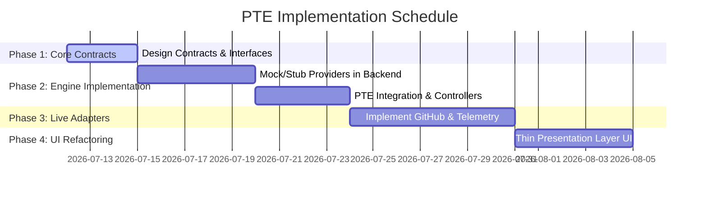

# 🧬 Product Twin Engine (PTE) Specification

**Title:** Product Twin Engine (PTE) Specs & Interfaces  
**Task Code:** TASK_CT_002  
**Status:** Approved for Implementation  
**Owner:** Principal Platform Architect  
**Last Updated:** 2026-07-11  

---

## 1. Overview & Conceptual Architecture

The **Product Twin Engine (PTE)** is a centralized backend service orchestrating live, operational data points from development, QA, telemetry, and business systems to compile a real-time **ProductTwinSnapshot** for every product in the ecosystem. 

Rather than relying on static UI files, the UI consumes a single unified API endpoint. The engine queries dedicated sub-engine providers to compute aggregate scores (Engineering, AI, Security, Operations) dynamically.

```mermaid
graph TD
    UI[Control Tower UI] -->|GET /api/v1/product-twin/{id}| API[PTE Controller]
    API --> PTE[ProductTwinEngine]
    
    PTE --> DNA[ProductDNAEngine]
    PTE --> CAP[CapabilityEngine]
    PTE --> GIT[GitEngine]
    PTE --> QA[QAEngine]
    PTE --> AI[AIAgentEngine]
    PTE --> TEL[TelemetryEngine]
    PTE --> CLD[CloudEngine]
    PTE --> KWL[KnowledgeEngine]
    
    GIT --> GitProv[GitHub API / Mock Provider]
    TEL --> PromProv[Prometheus / Redis / Asterisk Stubs]
    CLD --> DockerProv[Docker / Kubernetes Provider]
```

---

## 2. Standard Service Contract (`ProductTwinSnapshot`)

The backend returns a unified DTO. Below is the C# contract specification:

```csharp
namespace EmareTicket.Contracts.ProductTwin;

public record ProductTwinSnapshot(
    string ProductId,
    ProductDna Dna,
    MaturityProgress Progress,
    List<CapabilityMetric> Capabilities,
    List<AiAgentStatus> Agents,
    EngineeringSummary Engineering,
    List<DeploymentMetric> Deployments,
    TelemetrySnapshot Telemetry,
    KnowledgeSummary Knowledge,
    List<WhiteLabelClientDto>? WhiteLabelClients = null
);

public record ProductDna(
    string Mission,
    string Vision,
    string Owner,
    List<string> Repositories,
    List<string> CloudResources,
    List<string> Dependencies,
    string ArchitectureStyle,
    string CurrentVersion,
    List<RiskItem> Risks,
    List<TechDebtItem> TechnicalDebt,
    bool HasWhiteLabelSupport
);

public record MaturityProgress(
    int Architecture,
    int Backend,
    int Frontend,
    int Mobile,
    int Ai,
    int Qa,
    int Documentation,
    int Production
);

public record CapabilityMetric(
    string Name,
    string Status, // "Draft" | "Staging" | "Production"
    int CompletionPercentage,
    int TestCount,
    double TestCoverage,
    int TechnicalDebtCount,
    string Owner,
    DateTime LastCommitAt,
    string RelatedAdrId,
    string RelatedDocPath
);

public record AiAgentStatus(
    string Name,
    string State, // "ACTIVE" | "WORKING" | "WAITING" | "OFFLINE"
    string CurrentTask,
    double Confidence,
    string Eta,
    DateTime LastMemorySyncAt,
    string? Blocker = null
);

public record EngineeringSummary(
    int OpenPullRequests,
    int ActiveBranches,
    string BuildStatus, // "Passing" | "Failing" | "Building"
    int PassedTests,
    int TotalTests,
    double TestCoverage,
    string LastReleaseVersion,
    DateTime LastReleaseAt,
    DateTime LastDeployAt
);

public record DeploymentMetric(
    string Environment, // "Staging" | "Production"
    string Hostname,
    string Version,
    string Status, // "Healthy" | "Unhealthy"
    bool SslValid,
    DateTime SslExpiryDate,
    DateTime LastBackupAt
);

public record TelemetrySnapshot(
    double CpuUsagePercentage,
    double MemoryUsageMb,
    string RedisStatus,
    string PostgresStatus,
    string RabbitMqStatus,
    string AsteriskStatus,
    int SignalRConnectionCount,
    double DiskFreePercentage
);

public record KnowledgeSummary(
    List<string> AvailableAdrs,
    List<string> CapabilityDocuments,
    string ConstitutionVersion,
    DateTime LastIndexAt
);

public record WhiteLabelClientDto(
    string ClientName,
    string BrandingHex,
    string Domain,
    string LicenseLimit,
    int ActiveSessions,
    List<string> ActiveModules
);

public record RiskItem(string Id, string Risk, string Severity, string Mitigation);
public record TechDebtItem(string Id, string Debt, string PlannedSprint);
```

---

## 3. Engine Interfaces & Provider Abstractions

To achieve modularity and support seamless testing, PTE relies on provider abstractions.

```csharp
namespace EmareTicket.Application.Abstractions.ProductTwin;

using EmareTicket.Contracts.ProductTwin;

public interface IProductTwinEngine
{
    Task<ProductTwinSnapshot> GetSnapshotAsync(string productId, CancellationToken ct = default);
}

public interface IProductDnaEngine { Task<ProductDna> GetDnaAsync(string productId, CancellationToken ct = default); }
public interface ICapabilityEngine { Task<List<CapabilityMetric>> GetCapabilitiesAsync(string productId, CancellationToken ct = default); }
public interface IGitEngine { Task<EngineeringSummary> GetGitSummaryAsync(string productId, CancellationToken ct = default); }
public interface IAIAgentEngine { Task<List<AiAgentStatus>> GetAgentStatusesAsync(string productId, CancellationToken ct = default); }
public interface ITelemetryEngine { Task<TelemetrySnapshot> GetTelemetryAsync(string productId, CancellationToken ct = default); }
public interface ICloudEngine { Task<List<DeploymentMetric>> GetDeploymentsAsync(string productId, CancellationToken ct = default); }
public interface IKnowledgeEngine { Task<KnowledgeSummary> GetKnowledgeSummaryAsync(string productId, CancellationToken ct = default); }
```

### 3.1. Telemetry Provider Abstraction
```csharp
public interface ITelemetryProvider
{
    Task<double> GetCpuUsageAsync(string productId);
    Task<double> GetMemoryUsageAsync(string productId);
    Task<string> CheckDatabaseStatusAsync(string connectionString);
}
```

---

## 4. Implementation Steps & Migration Plan



### Phase 1: Core Contracts & Interfaces
Declare all DTOs and Engine Interfaces in `EmareTicket.Contracts` and `EmareTicket.Application`.

### Phase 2: Mock Engine Implementation
Build a mock implementation of `IProductTwinEngine` that uses seed parameters to provide instant data for `SuperApp`, `Corvis`, `Assistant`, etc. Route the API controller `/api/v1/elyaf/product-twin/{productId}` to this service.

### Phase 3: Live Integration Providers
Replace stub implementations with concrete providers:
* **GitHub Provider**: Queries octokit/GitHub API using repository metadata mapped in `ProductDna`.
* **Telemetry Provider**: Reads from Prometheus endpoints, local database context status, and Asterisk AudioSocket channels.

### Phase 4: Thin Presentation UI
Refactor the React components in Next.js to call the query endpoint directly. Remove all client-side logic/adapters.

---

## 5. Verification & Testing Strategy

1. **Unit Tests**:
   * Mock sub-engines (`IGitEngine`, `ITelemetryEngine`) using `NSubstitute` to verify that `ProductTwinEngine` compiles the aggregate snapshot accurately.
2. **API Verification**:
   * Verify that `GET /api/v1/elyaf/product-twin/{id}` yields a standard JSON payload matching `ProductTwinSnapshot`.
3. **Frontend Integration Build**:
   * Confirm Next.js `npm run lint` and `npm run build` continue to succeed with the refactored schema.
