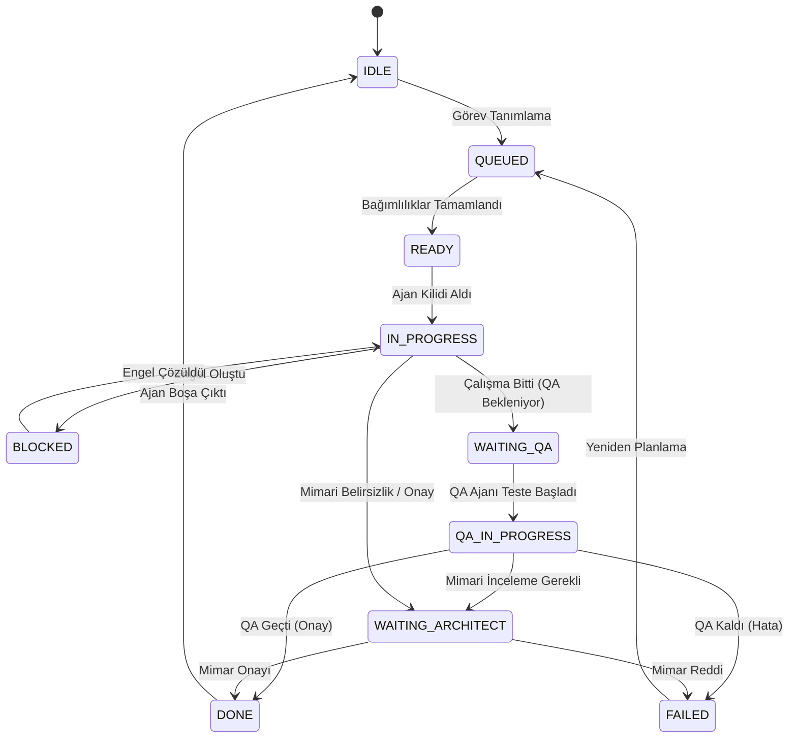
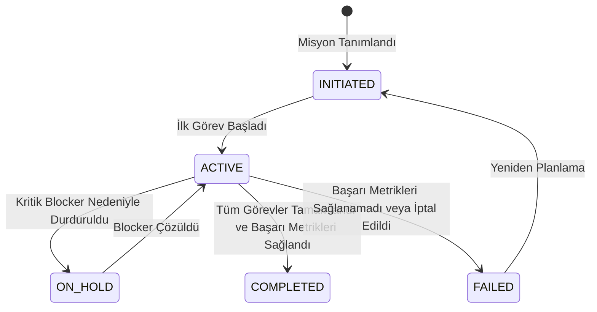

# Agent State Machine - AI Company OS v1

Bu doküman, Emare BOS AI İşletim Sistemi (AI Company OS v1) bünyesindeki hem **Görev (Task)** hem de **Misyon (Mission)** düzeyindeki durumları (states), bu durumların anlamlarını, kimler tarafından güncellenebileceğini ve izin verilen durum geçişlerini tanımlar.

---

## 1. Görev Düzeyi Durum Makinesi (Task-Level State Machine)

Görev düzeyindeki durum geçişleri geriye dönük uyumluluk amacıyla aynen korunmuştur.

- **IDLE:** Ajan aktif bir görev üstlenmemiş durumda bekliyor.
- **QUEUED:** Görev kuyruğa eklendi, ancak henüz READY olması için bağımlılıkların tamamlanması veya ajan atanması gerekiyor.
- **READY:** Görevin tüm bağımlılıkları tamamlandı ve ilgili ajan tarafından işe alınmaya (WIP Lock yazılmaya) hazır.
- **IN_PROGRESS:** Ajan görevi devraldı, `WORK_IN_PROGRESS.md` dosyasına kilidi (lock) yazdı ve çalışıyor.
- **BLOCKED:** Görevin ilerlemesi harici bir engele takıldı. `BLOCKERS.md` dosyasına kayıt girilmelidir.
- **WAITING_QA:** Geliştirme tamamlandı ve görevin QA onayına sunulması bekleniyor.
- **QA_IN_PROGRESS:** QA Ajanı (Agent 2) görevin entegrasyon testlerini ve kabul kriterlerini doğrulamaya başladı.
- **WAITING_ARCHITECT:** Mimari karar, kod incelemesi veya anayasa uyumluluk onayı için Chief Architect incelemesi bekleniyor.
- **DONE:** Görev başarıyla tamamlandı, QA ve/veya Mimar onayından geçti.
- **FAILED:** Görev hata aldı veya QA testlerinden geçemedi.

---

## 2. Misyon Düzeyi Durum Makinesi (Mission-Level State Machine)

Yüksek seviyeli hedeflerin (Missions) takibinde kullanılan durum makinesidir.

### Durum Tanımları (Missions)

### 1. INITIATED
- **Anlamı:** Misyon tanımlandı, başarı metrikleri ve sahibi (owner) belirlendi. Ancak henüz bağlı görevler üzerinde aktif çalışma başlamadı.
- **Kim Set Eder?** Coordinator (Agent 0) veya Product (Agent 3).
- **Sonraki Durumlar:** `ACTIVE`, `FAILED`

### 2. ACTIVE
- **Anlamı:** Misyona bağlı en az bir görev `IN_PROGRESS` veya `QA_IN_PROGRESS` durumuna geçti ve misyon hedeflerine yönelik çalışma devam ediyor.
- **Kim Set Eder?** Görevi yürüten Ajan veya Coordinator (Agent 0).
- **Sonraki Durumlar:** `ON_HOLD`, `COMPLETED`, `FAILED`

### 3. ON_HOLD
- **Anlamı:** Misyona bağlı kritik bir engelin (`BLOCKERS.md`) çözülememesi nedeniyle misyondaki ilerleme donduruldu.
- **Kim Set Eder?** Coordinator (Agent 0).
- **Sonraki Durumlar:** `ACTIVE`, `FAILED`

### 4. COMPLETED
- **Anlamı:** Misyona bağlı tüm alt görevler tamamlandı, QA ve mimari onaylar alındı, tanımlanan başarı metrikleri başarıyla sağlandı.
- **Kim Set Eder?** Coordinator (Agent 0).
- **Sonraki Durumlar:** Yok (Final State)

### 5. FAILED
- **Anlamı:** Tanımlanan başarı metriklerine ulaşılamadı, misyonun teknik veya işlevsel açıdan gerçekleştirilemeyeceği anlaşıldı veya misyon iptal edildi.
- **Kim Set Eder?** Coordinator (Agent 0) veya Chief Architect.
- **Sonraki Durumlar:** `INITIATED` (Yeniden yapılandırıldığında)
