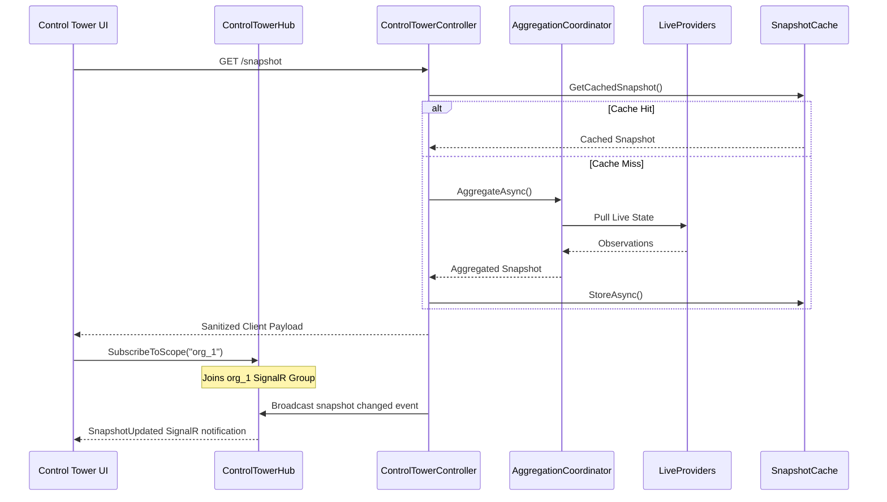

# Control Tower Snapshot Delivery Flow

This document details the aggregation and delivery pipeline.

```mermaid
sequenceDiagram
    participant UI as Control Tower UI
    participant Hub as ControlTowerHub
    participant REST as ControlTowerController
    participant Coordinator as AggregationCoordinator
    participant Provider as LiveProviders
    participant Cache as SnapshotCache

    UI->>REST: GET /snapshot
    REST->>Cache: GetCachedSnapshot()
    alt Cache Hit
        Cache-->>REST: Cached Snapshot
    else Cache Miss
        REST->>Coordinator: AggregateAsync()
        Coordinator->>Provider: Pull Live State
        Provider-->>Coordinator: Observations
        Coordinator-->>REST: Aggregated Snapshot
        REST->>Cache: StoreAsync()
    end
    REST-->>UI: Sanitized Client Payload

    UI->>Hub: SubscribeToScope("org_1")
    Note over Hub: Joins org_1 SignalR Group
    
    REST->>Hub: Broadcast snapshot changed event
    Hub-->>UI: SnapshotUpdated SignalR notification
```
